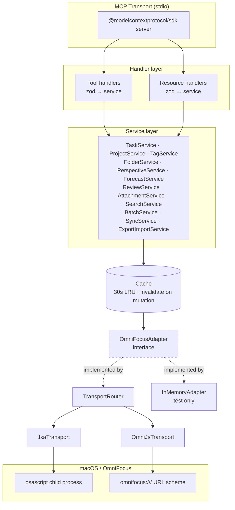

# Design: omnifocus-mcp

**Status:** v1.0 — implemented and shipped 2026-04-25
**Date:** 2026-04-19 (initial); shipped 2026-04-25
**Evaluates:** `SPEC.md`

A design document in the `systems_design.md` tradition: surfaces options, names tradeoffs, commits a recommendation, and flags what's being cut. Load-bearing decisions are recorded as ADRs under `docs/adr/`.

## Reading order

- **First time here:** read §1 (problem framing) then §6 (architecture), then skim the options sections (§2–§5). That's enough to understand the shape.
- **Implementing:** §12 (envelope), §13 (IDs), §14 (dates), §26 (example tool) — these define the patterns every tool follows.
- **Operating:** §17 (lifecycle), §18 (security), §20 (CI/CD), §21 (observability), §22 (config).
- **Understanding a decision:** section → linked ADR under `docs/adr/`.

## Table of contents

### Part I — Problem & options (decisions with alternatives)

1. [Problem framing](#1-problem-framing)
2. [Options for language + runtime](#2-options-for-language--runtime) — ADR-0001
3. [Options for OF transport](#3-options-for-of-transport) — ADR-0002
4. [Options for tool surface](#4-options-for-tool-surface) — ADR-0003
5. [Options for opt-in raw script tools](#5-options-for-opt-in-raw-script-tools) — ADR-0004

### Part II — Architecture (how the pieces fit)

6. [Architecture](#6-architecture) — layering, adapter interface, error taxonomy, caching, concurrency, tool description standard, observability, circuit breaker, loop detection
7. Reliability / Scalability / Maintainability evaluation (§7)
8. What's being cut (§8)
9. Build sequence (§9) — maps to GitHub Issues + milestones
10. Evaluation checklist (§10)
11. Cross-references (§11)

### Part III — Contracts and cross-cutting concerns

12. [Tool response envelope](#12-tool-response-envelope) — ADR-0013
13. [ID strategy](#13-id-strategy) — ADR-0008
14. [Date & time handling](#14-date--time-handling) — ADR-0007
15. [Pagination](#15-pagination)
16. [Concurrency & backpressure](#16-concurrency--backpressure) — ADR-0009
17. [Lifecycle](#17-lifecycle)
18. [Security posture](#18-security-posture)
19. [Testing strategy](#19-testing-strategy)
20. [CI/CD](#20-cicd)
21. [Observability contract](#21-observability-contract)
22. [Configuration & environment](#22-configuration--environment)
23. [Distribution & install](#23-distribution--install) — ADR-0012
24. [Versioning & stability contract](#24-versioning--stability-contract) — ADR-0011
25. [Dependency inventory](#25-dependency-inventory)
26. [Example tool — reference implementation for `task_list`](#26-example-tool--reference-implementation-for-task_list)
27. [Internationalization & encoding](#27-internationalization--encoding)
28. [MCP resources](#28-mcp-resources)

---

## 1. Problem framing

OmniFocus has no public REST API. The only programmatic surfaces are:

1. **JXA** (`osascript -l JavaScript`) — access to the Scripting Bridge dictionary; synchronous; structured return values; older API with some gaps around perspectives and plug-ins
2. **OmniJS** via URL scheme (likely `omnifocus:///omnijs-run?script=…` per Omni Automation docs; _exact form verified in M0 OmniJS spike before `OmniJsTransport` is written_) — Omni's strategic JS API; async, return values only via filesystem/callback; covers everything JXA can't reach, including custom perspectives and plug-in invocation
3. **URL scheme for "add task"** — one-shot task creation; no query surface; ignored for our purposes
4. **The SQLite database file** — undocumented, unstable; **do not touch** (noted here and in AGENTS.md gotchas; no ADR — the decision is too obvious to contest)

We must cover the full OmniFocus feature surface (per `project_scope.md`) via MCP tools and resources, for a single-user, local-only agent setup, with engineering-excellence constraints on reliability, scalability, and maintainability.

---

## 2. Options for language + runtime

| Option | Approach | Fits when | Tradeoffs |
| ------ | -------- | --------- | --------- |
| **A. TypeScript + Node.js** | Official MCP SDK; `child_process` to shell out to `osascript`; same language as JXA scripts | Single-person dev team, wants mature MCP SDK, values type safety and ecosystem | Node startup ~100ms; `execFile` per call adds overhead; still the fastest path to correct and maintainable |
| B. Python + MCP SDK | Python MCP SDK; `subprocess` to `osascript` | Team already Python-native | No advantage — still shelling to osascript; language switch between server and OF scripts; MCP SDK less mature than TS |
| C. Swift + ScriptingBridge | Native in-process calls to OF via ScriptingBridge framework; no `osascript` shell-out | Willing to absorb MCP SDK immaturity for performance | MCP Swift SDK is early; less community; harder to distribute; overkill for 95% of calls whose bottleneck is OF itself, not IPC |
| D. Go + MCP SDK | Static binary; goroutines for queueing | Team wants a single binary | Same shell-out to osascript (no scriptingbridge from Go); language switch; no meaningful win |

**Recommendation: Option A (TypeScript + Node.js).** Recorded as **ADR-0001**.

**What would change this:** if per-call overhead becomes a measured bottleneck in real usage (unlikely — OF's response time dominates), revisit C.

---

## 3. Options for OF transport

| Option | Approach | Fits when | Tradeoffs |
| ------ | -------- | --------- | --------- |
| A. JXA only | Shell to `osascript -l JavaScript`; accept that custom perspectives and plug-ins are out of reach | Want minimum complexity | Fails SPEC requirement for full coverage; leaves ~15% of OF unreachable |
| B. OmniJS only | URL-scheme invocation + filesystem result files | Want Omni's strategic API | Async callback dance; no sync return values; every tool becomes harder |
| **C. Dual transport with router** | `OmniFocusAdapter` interface; internal `TransportRouter` picks JXA by default, OmniJS for the specific features that need it | Want full coverage with the simplest path per feature | More moving parts; two script dialects; requires a router that is itself well-tested |

**Recommendation: Option C.** Recorded as **ADR-0002**.

**What would change this:** if Omni ships a JXA-complete OmniJS alternative with synchronous return values, consolidate on OmniJS.

---

## 4. Options for tool surface

| Option | Approach | Fits when | Tradeoffs |
| ------ | -------- | --------- | --------- |
| A. Few, powerful tools | 8–12 generic tools with wide schemas (`omnifocus_query`, `omnifocus_mutate`) | Want small tool list | Agent must understand complex nested schemas; tool descriptions become essays; error disambiguation is hard |
| **B. Many, narrow tools with consistent verbs** | A wide surface of `<noun>_<verb>` tools: `task_list`, `task_create`, `task_update`, …, `project_list`, … | Want LLM-friendly discoverability | Larger tool surface (modern agents handle wide surfaces fine); more handler boilerplate (mitigated by patterns) |
| C. Split across multiple MCP servers | Read-server + write-server (or per-noun servers) | Want privilege separation | User configures multiple servers; more ops surface; premature for a single-user tool |

**Recommendation: Option B, with namespaced `<noun>_<verb>` naming.** Recorded as **ADR-0003**.

If the agent tool-selection rate degrades as we add tools, fall back to C (split into two servers by read/write). The codebase should remain structured so that split is mechanical, not architectural.

---

## 5. Options for opt-in raw script tools

| Option | Approach | Fits when | Tradeoffs |
| ------ | -------- | --------- | --------- |
| A. No escape hatch | Wrap everything or nothing | Want strict tool contracts | Any OF feature we miss is unreachable until we wrap it; blocks power users |
| **B. Opt-in escape hatch (`run_jxa_script`, `run_omnijs_script`)** | Off by default; enabled by `OMNIFOCUS_ALLOW_RAW_SCRIPT=1`; loudly dangerous in description | Single-user tool where the user owns the blast radius | Exposes arbitrary-script execution to the agent; must be off by default |
| C. Always-on escape hatch | Ship enabled | Power-user-only audience | Unsafe default — violates "safe by default" principle |

**Recommendation: Option B.** Recorded as **ADR-0004**.

---

## 6. Architecture

### 6.1 Layering



The **adapter interface is the critical seam.** Services never touch `osascript` or URL schemes. Tests swap `InMemoryAdapter` for zero-friction unit coverage; real use swaps in `TransportRouter`, which picks JXA or OmniJS per operation.

### 6.2 Directory layout

```
omnifocus-mcp/
├── AGENTS.md
├── SPEC.md
├── DESIGN.md
├── README.md
├── package.json
├── tsconfig.json
├── biome.json
├── vitest.config.ts
├── docs/
│   └── adr/
│       ├── 0001-language-and-runtime.md
│       ├── 0002-omnifocus-transport-dual.md
│       ├── 0003-tool-surface-namespaced.md
│       ├── 0004-raw-script-escape-hatch.md
│       ├── 0005-script-assets-as-files.md
│       └── 0006-read-cache-strategy.md
├── src/
│   ├── index.ts                 # entry point
│   ├── server/
│   │   ├── mcpServer.ts
│   │   ├── registerTools.ts
│   │   └── registerResources.ts
│   ├── tools/
│   │   ├── task/
│   │   │   ├── list.ts
│   │   │   ├── get.ts
│   │   │   ├── create.ts
│   │   │   └── …
│   │   ├── project/
│   │   └── …
│   ├── resources/
│   │   ├── inbox.ts
│   │   ├── forecastToday.ts
│   │   └── …
│   ├── services/
│   │   ├── taskService.ts
│   │   ├── projectService.ts
│   │   └── …
│   ├── domain/
│   │   ├── task.ts              # types + zod schemas
│   │   ├── project.ts
│   │   ├── tag.ts
│   │   ├── folder.ts
│   │   ├── perspective.ts
│   │   ├── repetition.ts
│   │   ├── attachment.ts
│   │   ├── review.ts
│   │   └── ids.ts               # branded ID types
│   ├── adapter/
│   │   ├── OmniFocusAdapter.ts  # interface
│   │   ├── router.ts            # TransportRouter
│   │   ├── jxa/
│   │   │   └── JxaTransport.ts
│   │   ├── omnijs/
│   │   │   └── OmniJsTransport.ts
│   │   └── inMemory/
│   │       └── InMemoryAdapter.ts
│   ├── scripts/
│   │   ├── jxa/
│   │   │   ├── task_list.js
│   │   │   ├── task_create.js
│   │   │   └── …
│   │   └── omnijs/
│   │       ├── perspective_evaluate.js
│   │       └── plugin_invoke.js
│   ├── cache/
│   │   └── lruCache.ts
│   ├── errors/
│   │   └── index.ts
│   ├── logging/
│   │   └── logger.ts
│   └── config/
│       └── env.ts
└── tests/
    ├── unit/
    └── integration/             # gated by OMNIFOCUS_INTEGRATION=1
```

A new developer reading the directory tree should be able to answer "where does X live?" without opening any files. This is the evaluation checklist test: `Can a new developer understand this system's structure from its directory layout alone?` — yes.

### 6.3 Adapter interface

```typescript
export interface OmniFocusAdapter {
  // Tasks
  listTasks(filter: TaskFilter): Promise<Task[]>
  getTask(id: TaskId): Promise<Task>
  createTask(input: CreateTaskInput): Promise<TaskId>
  updateTask(id: TaskId, patch: UpdateTaskInput): Promise<void>
  completeTask(id: TaskId, at?: Date): Promise<void>
  // …one method per SPEC functional requirement

  // Metadata
  syncTrigger(): Promise<SyncStatus>
  getLastSync(): Promise<SyncStatus>

  // Raw (only wired when opt-in)
  runJxaScript?(script: string): Promise<unknown>
  runOmniJsScript?(script: string): Promise<unknown>
}
```

All three transports (`JxaTransport`, `OmniJsTransport`, `InMemoryAdapter`) implement the same contract. `TransportRouter` is itself an `OmniFocusAdapter` that delegates per-method to the right underlying transport.

### 6.4 Script asset discipline — ADR-0005

JXA/OmniJS scripts live as `.js` files under `src/scripts/`. Each script:

- Reads a single JSON argument from `process.argv[1]` (JXA) or `argument` (OmniJS)
- Returns a single JSON string via `JSON.stringify` as the last expression
- Is typed via JSDoc, linted, and bundled as a string at build time (`tsup` loader)

This scales cleanly to 50+ scripts where inline template literals would not.

### 6.5 Caching — ADR-0006

- LRU cache, default TTL 30s, default capacity 256 entries, keyed by tool name + serialized args
- Read tools consult cache first, fall through to adapter on miss
- Every mutating service method emits a cache-invalidation event covering a typed scope:
  - `task_update(id)` → invalidates `task:${id}`, `project:${projectId}`, `forecast:*`, `perspective:*`, `search:*`
  - Conservative invalidation is correct; speculative fine-grained invalidation is out of scope
- Cache is in-memory only; no persistence. Server restart = cold cache.

### 6.6 Concurrency

- **Reads:** parallel within the adapter; JXA transport internally queues to serialize against `osascript` (one child process at a time is safer than many concurrent)
- **Writes:** strictly serialized via a single-slot queue. A write in flight blocks subsequent writes until complete. Reads may proceed concurrently (dirty-read of cache tolerated).
- **OmniJS writes:** same queue, with an additional timeout because URL-scheme callbacks are async and can genuinely hang if OF is wedged

### 6.7 Error taxonomy

Authoritative list. Every throw in the server is one of these; generic `Error` is forbidden by lint rule. Grouped by remediation class so an agent reading an error knows, at a glance, whether to retry, wait, fix input, or stop and ask the user.

```typescript
class OmniFocusError extends Error { readonly code: string }

// Environment — retry is pointless; user action required
class OmniFocusNotRunning       extends OmniFocusError { code = "OF_NOT_RUNNING" }
class PermissionDenied          extends OmniFocusError { code = "OF_PERMISSION_DENIED" }
class FeatureRequiresPro        extends OmniFocusError { code = "OF_FEATURE_REQUIRES_PRO" }
class FeatureRequiresOfVersion  extends OmniFocusError { code = "OF_FEATURE_REQUIRES_VERSION" }

// Input — agent should fix the input before retrying
class ValidationError           extends OmniFocusError { code = "OF_VALIDATION" }
class NotFound                  extends OmniFocusError { code = "OF_NOT_FOUND" }

// Transient — agent may retry after waiting
class Timeout                   extends OmniFocusError { code = "OF_TIMEOUT" }
class RateLimited               extends OmniFocusError { code = "OF_RATE_LIMITED" }    // wall-clock wait
class QueueFull                 extends OmniFocusError { code = "OF_QUEUE_FULL" }      // write queue saturated
class CircuitOpen               extends OmniFocusError { code = "OF_CIRCUIT_OPEN" }

// Infrastructure — usually transient but not the agent's to fix
class TransportUnavailable      extends OmniFocusError { code = "OF_TRANSPORT_UNAVAILABLE" }
class ScriptError               extends OmniFocusError { code = "OF_SCRIPT_ERROR" }

// Server lifecycle — stop and reconnect
class ServerShuttingDown        extends OmniFocusError { code = "OF_SHUTTING_DOWN" }
```

`RateLimited`, `QueueFull`, and `CircuitOpen` are distinct top-level classes — **not** subclasses of `ValidationError`. An agent interprets "validation" as "your input is bad; tell the user." Backpressure is "the system is busy; wait." Conflating them causes agents to surface the wrong remediation.

Tool handlers catch these at the boundary and translate to MCP error responses with structured `{ code, message, suggestion, details }` payloads — per `agent_systems.md` "actionable errors" principle. The `suggestion` field is prescribed per class (default text; each throw site can override).

### 6.8 Tool description standard

Every tool description follows a four-section template so agents can parse it reliably:

```
<one-sentence summary of what the tool does>

Use when: <the specific scenario that calls for this tool>
Do NOT use when: <sibling tools to prefer instead, and why>

Returns: <shape of the data field — key fields named>
Errors: <which ErrorCodes can occur and what they mean here>

Side effects: <mutates? invalidates cache? triggers sync? idempotent? safe to retry?>
```

Example for `task_find_by_name`:

```
Searches for tasks whose name contains the given string. Returns all matches — never picks one silently.

Use when: you have a task name (e.g. from user input) and need its persistent ID.
Do NOT use when: you already have an ID — use task_get instead (cheaper, unambiguous).

Returns: Task[] — each with id, projectId, projectName, status, dueDate, tags. Empty array if no match.
Errors: OF_NOT_RUNNING, OF_TIMEOUT

Side effects: Read-only. Safe to retry. Cached for 30s.
```

The linter test (TASKS #78) asserts every tool description includes all four sections. The Success Criteria (SPEC) includes an LLM-readability review: a fresh Claude instance must pick the correct tool for 20 representative prompts without additional context.

### 6.8.1 Tool-count policy (#478)

Living docs describe the **shape** of the tool surface (domains, verbs, patterns), never the **count**. The capabilities resource (`omnifocus://capabilities`) and `internal_status` publish the live count at runtime; `docs/tools.md` is auto-generated from `ALL_TOOL_DESCRIPTIONS` on every build. Anything else is a copy that decays.

This policy is enforced by `scripts/verify-no-tool-counts.sh`, wired into `meta-lint.yml`. The lint allowlist covers genuinely-dated artifacts:

- `CHANGELOG.md` — historical release entries are point-in-time
- `docs/tools.md` — auto-generated; the count IS the live truth, regenerated per build
- `docs/validation/**` — dated audit / readability reports
- `docs/llm-readability-review-v1.md` — versioned snapshot

Add to the allowlist only with a one-line rationale per entry; rewording is almost always cheaper.

### 6.9 Observability

- Structured logs via `pino` to stderr
- Every tool call emits one span: `{ tool, durationMs, transport, cacheHit, result, correlationId }`
- No PII (task content) at `info`; only at `debug` or below
- Health surface: `internal_status` tool returns `{ uptimeMs, of_running, last_sync, cache_stats, circuit_states }`

### 6.10 Circuit breaker

Per `agent_systems.md`. Per-tool, 3 consecutive failures within 60s opens the circuit; subsequent calls fail fast with `CircuitOpen` for 60s before a half-open test. Prevents a broken OF install (e.g. not running, permission revoked) from burning through the agent's context with retries.

### 6.11 Loop detection

Per `agent_systems.md`. Server tracks recent tool invocations by (tool, serialized-args) hash; if the same invocation occurs ≥5 times within 60s, the next response includes a warning in the structured response: `{ warning: "identical_call_repeated", count, suggestion }`.

---

## 7. Reliability / Scalability / Maintainability evaluation

### Reliability

- What happens when OmniFocus is unavailable? → `OmniFocusNotRunning` with suggestion; circuit breaker prevents retry-storm
- What happens when an OmniJS callback never fires? → transport timeout (default 45s), `Timeout` error with `{ transport: "omnijs" }`
- What happens on partial batch failure? → batch is not atomic in v1; error includes per-index failure details; **open question in SPEC**
- Data integrity under concurrent mutations? → serialized writes preclude races at the MCP layer; OF itself handles its own consistency
- Permission revoked mid-session? → typed `PermissionDenied` with instructions; does not crash server

### Scalability

- What breaks first, and when? → For a single-user OF (< 50k tasks typical), the bottleneck is JXA round-trip latency, not anything we control. Batch ops and the LRU cache handle the load patterns we expect.
- 10× load scenario? → N/A for single-user; if this ever grew to a shared MCP (out of scope), the adapter queue becomes the bottleneck and we'd shard by OF install.
- Memory profile? → Tasks + projects held only in the cache; bounded by capacity (256 entries default). No unbounded growth.

### Maintainability

- Can a new developer understand structure from directory layout? → yes (see §6.2)
- Module boundaries reflected in code? → yes: `adapter/` cannot import from `services/`, enforced by a lint rule
- Data mutation atomicity across boundaries? → writes serialized; no distributed transaction concerns
- Deployment unit? → a single Node CLI distributed via `npx omnifocus-mcp` — one deployable

---

## 8. What's being cut (and why it's safe to cut now)

| Cut | Rationale | Trigger to revisit |
| --- | --------- | ------------------ |
| Remote MCP transports (SSE, HTTP) | Single-user local tool; stdio is the right default | A user requests running this on one Mac, consuming from another |
| Streaming responses | Pagination is simpler; forecasts and task lists fit in a single MCP response | A single common query returns > 10MB of data |
| Persistent cache across restarts | 30s TTL is short anyway; restart cost is acceptable | Measured evidence cold-start is hurting UX |
| Multi-install support | One OF per server instance | Any multi-user scenario appears |
| Conflict resolution | OF handles its own sync conflicts | OF stops handling them well |
| Custom telemetry beyond pino | OpenTelemetry is heavy for a single-user tool | A user wants production-style metrics |
| Automatic OF launch on `OmniFocusNotRunning` | Silent side effects are surprising; prefer explicit `app_launch` tool | User preference, trivial to add later |
| Idempotency keys on mutations | Adds complexity; single-user blast radius is small | Multi-agent or unreliable-transport scenarios |

---

## 9. Build sequence (detailed in GitHub Issues + milestones)

Resequenced after user confirmed rich reliance on custom perspectives — OmniJS is no longer a late addition. Milestones are contiguous: M0, M1, M2, M3, M4, M5.

1. **M0 Foundation.** Stack, adapter interface, in-memory adapter, **both transports' spikes**, JXA transport, OmniJS transport, TransportRouter, typed errors, cache, logger, pool/queue, lifecycle, stdout guard. Ends with the server booting and running trivial scripts on both transports.
2. **M1 Core surface.** Task + project CRUD with pagination. 80% of daily use.
3. **M2 Metadata + perspectives (OmniJS-enabled).** Tags, folders, forecast, search, **both built-in and custom perspective evaluation**. This is the phase where the rich-custom-perspectives workflow becomes usable.
4. **M3 Advanced.** Repetition, notes (plain + rich), review, batch, transport text.
5. **M4 Long tail.** Attachments, export/import, sync, opt-in raw-script tools, plug-in invocation (generic).
6. **M5 Polish.** Loop detection, internal_status, E2E, CI, distribution, docs.

Each phase ends with a working, integration-tested system valuable on its own. The originally-planned "standalone OmniJS transport" milestone was absorbed into M0 (infrastructure) and M2 (custom perspective evaluation).

---

## 10. Evaluation checklist (from `systems_design.md`)

- [x] What happens when the database is unavailable? → `OmniFocusNotRunning`, circuit breaker
- [x] What happens when an external service times out? → `ScriptError` with timeout reason
- [x] 10× load? → bounded by cache and queue; single-user scope
- [x] Can a new dev understand structure from directory alone? → yes
- [x] Module boundaries reflected in code? → enforced by lint
- [x] Any non-atomic mutation across system boundary? → writes serialized; only concern is the batch-atomicity open question
- [x] Deployment unit? → `npx omnifocus-mcp` single binary

---

## 11. Cross-references

- `SPEC.md` — functional scope evaluated here
- `docs/domain-reference.md` — canonical OmniFocus domain schemas and glossary
- `docs/adr/0001-language-and-runtime.md` — TypeScript + Node 24
- `docs/adr/0002-omnifocus-transport-dual.md` — JXA + OmniJS router
- `docs/adr/0003-tool-surface-namespaced.md` — namespaced verb tool surface
- `docs/adr/0004-raw-script-escape-hatch.md` — opt-in raw-script tools
- `docs/adr/0005-script-assets-as-files.md` — scripts as first-class source files
- `docs/adr/0006-read-cache-strategy.md` — 30s LRU, invalidate-on-write
- `docs/adr/0007-dates-iso8601-with-offset.md` — date contract at the boundary
- `docs/adr/0008-ids-branded-opaque-strings.md` — ID strategy
- `docs/adr/0009-concurrency-pool-and-queue.md` — reads pool, writes serialized
- `docs/adr/0010-mcp-transport-stdio.md` — stdio-only for v1
- `docs/adr/0011-versioning-and-stability.md` — semver + tool contract stability
- `docs/adr/0012-distribution-npx.md` — `npx` + published npm package
- `docs/adr/0013-tool-response-envelope.md` — uniform response envelope as public contract
- `docs/adr/0014-e2e-harness-strategy.md` — in-memory adapter switch for E2E
- `docs/adr/0015-nl-excellence-response-envelope.md` — clarification kind, hints, echo-back summary
- `docs/adr/0017-mutation-testing-release-gate.md` — Stryker mutation testing as release-time hard gate
- `docs/adr/0018-calendar-bridge-eventkit-only.md` — EventKit-only calendar bridge via Swift-binary subprocess
- [GitHub Issues](https://github.com/torsday/omnifocus-mcp/issues) + [Project #4](https://github.com/users/torsday/projects/4) — live backlog derived from this design

---

## 12. Tool response envelope

Every tool returns a JSON object with a uniform shape. This is the stability contract (per ADR-0011); fields can be added, never removed or renamed without a major version.

> NL-excellence extensions to this envelope (additive in v1.x): a third `clarification` response kind, an optional `hints[]` array on `ok`, and a `meta.humanReadableSummary` field on writes. See [ADR-0015](./docs/adr/0015-nl-excellence-response-envelope.md).

### Success envelope

```typescript
interface ToolSuccess<T> {
  data: T;                      // tool-specific payload (typed per tool)
  meta: {
    correlationId: string;      // ULID, echoed to logs
    durationMs: number;
    cacheHit: boolean;
    transport: "jxa" | "omnijs" | "cache" | "memory";
    ofVersion: string;          // e.g. "4.5.2"
    syncPending?: boolean;      // true on mutations if unsent changes exist; agent uses to decide when to call sync_trigger
    warnings?: string[];        // non-fatal issues surfaced to the agent
  };
  pagination?: {                // present on list-shaped tools only
    cursor: string | null;      // opaque; pass to next call or null at end
    hasMore: boolean;
    total?: number;             // only when cheap to compute
  };
}
```

### Error envelope

```typescript
interface ToolError {
  error: {
    code: string;               // e.g. "OF_NOT_RUNNING"
    message: string;            // human readable, English, no internals
    suggestion?: string;        // what the agent should do next
    details?: Record<string, unknown>; // per-error-code structured payload
  };
  meta: {
    correlationId: string;
    durationMs: number;
    transport?: "jxa" | "omnijs" | "cache" | "memory";
  };
}
```

The `suggestion` field is what makes errors _actionable_ (per `agent_systems.md`). Every typed error class has a default suggestion; tools override when they have better context.

### Mutation response contract

Every write tool (`task_create`, `task_update`, `task_complete`, `project_create`, …) returns the **full updated domain object** in `data`, not just an acknowledgment. This means agents never need a follow-up read after a write — the round-trip is self-contained. The only exception is destructive deletes, which return `{ deleted: true, id }` because the object no longer exists.

### Example: error for missing task

```json
{
  "error": {
    "code": "OF_NOT_FOUND",
    "message": "Task not found",
    "suggestion": "Confirm the ID with task_list or check whether the task was deleted. Use the persistent ID from OmniFocus, not a name.",
    "details": { "resource": "task", "id": "hPQ4RuKp9fW" }
  },
  "meta": { "correlationId": "01JBZK7PDR6XSYVMWT5YYVH8VQ", "durationMs": 12 }
}
```

---

## 13. ID strategy

OmniFocus uses **persistent alphanumeric IDs** (e.g. `"gHqVKr3xAWo"`) that survive renames and restructures. Names are not unique, are editable, and drift — they cannot be identifiers.

### Design

- **At the API boundary:** IDs are opaque strings. Clients pass what we gave them; no parsing, no assumptions about format.
- **Inside the code:** IDs are _branded types_ so a `TaskId` cannot accidentally be used where a `ProjectId` is expected:
  ```typescript
  export type TaskId       = string & { readonly __brand: "TaskId" };
  export type ProjectId    = string & { readonly __brand: "ProjectId" };
  export type TagId        = string & { readonly __brand: "TagId" };
  export type FolderId     = string & { readonly __brand: "FolderId" };
  export type AttachmentId = string & { readonly __brand: "AttachmentId" };
  ```
- **Constructors** (`TaskId.of(s)`) validate that the string is non-empty and matches OF's ID shape (conservative regex). Zod schemas use `z.string().transform(...)` to produce branded values.
- **Lookup tools never accept names.** `task_get` takes an ID, not a name. Lookup-by-name is an explicit tool: `task_find_by_name` (ambiguous, documented).

### Why branded types (over plain strings)

Prevents the class of bug where a caller passes a `TagId` to `task_get` and the type system silently allows it. The cost is a small constructor boilerplate; the benefit is compile-time elimination of an entire bug class.

Recorded as **ADR-0008**.

---

## 14. Date & time handling

OmniFocus stores wall-clock timestamps in the user's local time zone. At the MCP boundary we use **ISO-8601 with offset** (`2026-04-19T12:00:00-05:00`), never bare local time, never UTC without offset, never Unix epochs.

### Design

- **Inputs:** any field whose name ends in `Date`, `At`, `Due`, `Defer`, `Reviewed`, or `Completed` is ISO-8601 with offset on the way in. We accept UTC (`Z`) and offsets; we reject bare local (`2026-04-19T12:00:00`).
- **Outputs:** always ISO-8601 with the _user's current_ offset at the time of the query. If the user is `-05:00` today, all dates emerge as `-05:00`, even if they were stored during DST.
- **Null semantics:** "no date" is `null`, not an empty string or sentinel. An unset due date is `{ "due": null }`.
- **Ranges** (for filters): inclusive on both ends; `dueBefore: "2026-05-01T00:00:00-05:00"` matches due-at-midnight-local.
- **Timezone resolution:** we query the OS (`Intl.DateTimeFormat().resolvedOptions().timeZone`) at startup; users can override via `TZ` env var (Node respects this).
- **Adapter responsibility:** JXA scripts translate to/from OF's native `Date` objects using local wall-clock. The ISO-8601 contract ends at the adapter.

### Why ISO-8601 with offset

- Unambiguous across users and machines
- Agents (LLMs) handle ISO dates reliably; Unix epochs confuse them
- Offset preserved means no "which zone was this captured in?" mystery
- Sorting is lexicographic — cheap on both sides of the wire

Recorded as **ADR-0007**.

### Floating time zones

OmniFocus supports "floating" dates — times that follow the user as they travel across time zones rather than anchoring to a specific UTC moment. A 9 AM meeting set as floating reads as 9 AM in Tokyo and 9 AM in London.

Each date-bearing field (`deferDate`, `dueDate`) has a companion boolean: `deferDateFloating` / `dueDateFloating`.

**Representation contract:**
- When `true`, the field is present with value `true`.
- When `false` (or the date is not floating), the field is **omitted entirely** — not set to `false`. This keeps the domain type clean and avoids explicit-`undefined` confusion under `exactOptionalPropertyTypes`.

**Transport layer (JXA):**
- JXA cannot read per-date floating flags; the `Date` class in JXA does not expose `shouldUseFloatingTimeZone`.
- Read operations (`getTask`, `getProject`) return `deferDateFloating` / `dueDateFloating` as `undefined` / omitted for all tasks. This is a known transport limitation, not a bug.
- OmniJS (Omni Automation plug-in) does expose `Date.fromString(iso, floating)` and can set/read the flag, but that transport is not wired in this release.

**Write operations (create/update):**
- All MCP tools accept `deferDateFloating` and `dueDateFloating` as optional boolean inputs.
- The InMemoryAdapter fully round-trips these flags (used for testing).
- The JXA adapter passes the flag to the script, but the script-side support (`Date.fromString(iso, true)`) is documented as `notYetWired` pending OmniJS integration. JXA writes silently ignore the flag.

**Why keep the field if JXA can't read it?**
The schema, domain types, and tool contracts are forward-compatible. When OmniJS transport is added (or when OmniFocus exposes the flag via JXA), the field is already wired end-to-end — no breaking change required.

---

## 15. Pagination

List-shaped reads support cursor-based pagination with a **safe default cap**. Clients can override `limit` up to a hard ceiling or follow `cursor` for additional pages.

### Shape

Input (optional):

```typescript
{
  limit?: number;       // 1..1000; default: 200
  cursor?: string;      // opaque; from previous response
}
```

Output pagination block (present on every list tool response):

```typescript
{
  cursor: string | null;   // null means "no more results"
  hasMore: boolean;
  total?: number;          // omitted when computing it would double the cost
}
```

### Guardrails on unbounded queries

A `task_list` with no filter and no limit could return 50k rows on a large database, blowing the p95 SLO and the MCP response size. Two guardrails:

1. **Default limit of 200.** Clients who explicitly want more pass `limit`; unbounded queries must chase the cursor.
2. **Zod refinement on list schemas:** at least one of `{ limit, cursor, projectId, tagIds, available, completed, dueBefore, dueAfter, deferredBefore, parentId }` must be provided. Absent any of these, we reject with `ValidationError { code: "OF_VALIDATION", suggestion: "Provide a filter or a limit" }`. Prevents accidental full-table scans.

### Cursor construction

- Opaque to clients; base64url-encoded internally
- Encodes `{ lastCreatedAt, lastId, filterHash }`
- **Sort order is `(createdAt ASC, id ASC)`** — `createdAt` primary, `id` as deterministic tiebreak. OF's persistent IDs are short alphanumerics and not monotonic; sorting by ID alone would be non-deterministic across runs
- Invalidated on `filterHash` mismatch (returns `ValidationError`); the client must start a fresh query if filters change

### Why cursor, not offset

Offset pagination double-reads and has consistency issues under mutation. Cursors are stable and let JXA evaluate `created > lastCreatedAt OR (created == lastCreatedAt AND id > lastId)` cheaply inside the script.

---

## 16. Concurrency & backpressure

### Pools

- **Read pool:** default 2 concurrent `osascript` child processes. Larger pools don't help because OF's main thread serializes requests anyway; 2 gives us pipeline overlap without thrash. Configurable via `OMNIFOCUS_READ_POOL_SIZE`.
- **Write queue:** single-slot. Writes run one at a time.
- **OmniJS queue:** separate single-slot queue because URL-scheme callbacks contend for the file system.

### Backpressure

- Write queue has a soft cap (50 pending) beyond which new writes reject immediately with `QueueFull`. Prevents a runaway agent from pinning memory.
- Read pool uses unbounded queueing but a per-tool rate limit (default 120 calls / 60s / tool) rejects with a top-level `RateLimited` error (see §6.7) to prevent loop-detection edge cases. The default is deliberately generous — a weekly-review session can burst through `task_list`, `project_list`, `task_get`, `project_mark_reviewed` without tripping it.
- When a call is rejected for backpressure, the response includes `suggestion: "Wait before retrying; <N> operations queued"`.

### Thundering herd

Two identical in-flight reads coalesce: the second caller awaits the first's result rather than issuing a duplicate `osascript`. Cache layer handles this via a "pending requests" map keyed by the cache key.

Recorded as **ADR-0009**.

---

## 17. Lifecycle

### Startup sequence

1. Parse env vars, set log level
2. Initialize logger (stderr-only; hook `process.stdout.write` to detect violations and throw)
3. Register MCP server (stdio transport)
4. Register tools conditionally: always-on toolset always; `run_jxa_script` / `run_omnijs_script` only if `OMNIFOCUS_ALLOW_RAW_SCRIPT=1`
5. Log `server.started` event with version, capabilities, and resolved config — **path-shaped env vars (`OMNIFOCUS_ATTACHMENT_PATHS`, `TZ`) are logged as hashes, not literal values, to avoid leaking directory structure in operator logs**
6. Wait for `initialize` RPC from client

**OF detection is lazy:** we do not probe OF until the first tool call that needs it. Rationale: startup should be < 500ms with no macOS permission prompts; probing OF can take seconds and trigger permission dialogs.

### Version detection

On first successful JXA call, the adapter caches `{ ofVersion, ofEdition }` via a tiny JXA one-liner. Included in every response's `meta.ofVersion` thereafter. Tools that require OF 4 (or specific minor versions) check this and surface `FeatureRequiresOfVersion` if unmet.

### Shutdown sequence

- `SIGINT` / `SIGTERM`:
  1. Stop accepting new tool calls (MCP server rejects with `ServerShuttingDown`)
  2. Drain in-flight reads (grace window: 5s)
  3. Wait for write queue to drain (grace window: 10s)
  4. Close logger; flush stderr
  5. Exit 0
- Unhandled exception:
  - Log at `fatal`
  - Exit 1 (the client will reconnect on its own; partial state in OF is OF's concern)

---

## 18. Security posture

Threat model: a single user running the MCP server locally. The adversary is not a remote attacker (there's no network surface) but rather a **misbehaving or prompt-injected agent**. The blast radius is the user's OmniFocus data and the user's home directory.

### Controls

| Control                              | Enforcement                                                                                    |
| ------------------------------------ | ---------------------------------------------------------------------------------------------- |
| No network I/O from server           | Lint rule bans `http`, `https`, `fetch`, `node-fetch`, `axios`, `undici`; CI fails on import   |
| No stdout writes (MCP uses stdio)    | Startup hooks `process.stdout.write` to fail loudly; integration test asserts zero bytes out   |
| Attachment paths scoped              | Default allowlist `$HOME`; target path resolved via `fs.realpathSync` **before** allowlist check to prevent symlink escape; rejected paths return `ValidationError` with reason |
| Raw-script tools off by default      | Only registered when `OMNIFOCUS_ALLOW_RAW_SCRIPT=1`; loudly flagged; every call audit-logged  |
| No PII in `info` logs                | Structured logger redacts `name`, `note`, `noteHtml`, `tagNames` at `info`+; only `debug`-     |
| No secret storage                    | The server owns no secrets; OmniFocus auth is OF's concern                                     |
| Least-privilege macOS Automation     | Permission is requested for OmniFocus only; no other app; documented in the install flow      |
| Timeouts on every OF call            | JXA 30s, OmniJS 45s; prevents a wedged OF from holding resources indefinitely                  |
| Circuit breakers                     | Per-tool, 3 failures / 60s; reject fast rather than cascading failures                         |
| Rate limits                          | Per-tool 120/60s default; opt-out via env for integration-test runs                            |
| Raw script argument escaping         | We pass a single JSON argument to each JXA script; no shell-string interpolation anywhere      |
| Prompt injection containment         | Task names, notes, and tag names from OmniFocus are treated as untrusted content. They are never interpolated into `suggestion`, `message`, `warning`, or other protocol/metadata fields — only placed inside the typed `data` payload where the agent expects user content. |

### Non-goals (v1)

- No sandboxing of JXA/OmniJS scripts (impractical; OF's scripting is inherently privileged)
- No capability tokens per tool call (single-user; unnecessary complexity)
- No audit log persistence beyond stderr (operator can capture stderr to file)

---

## 19. Testing strategy

Five tiers, each with a distinct purpose and gating.

| Tier               | Scope                                                                | Gating                            | Runs in CI |
| ------------------ | -------------------------------------------------------------------- | --------------------------------- | ---------- |
| **Unit**           | Services, domain schemas, utils — against `InMemoryAdapter`         | Always                            | Yes        |
| **Contract**       | Same behavior from every `OmniFocusAdapter` implementation           | Always for `InMemoryAdapter`; integration tier for `JxaTransport` / `OmniJsTransport` | Partial (unit portion) |
| **Script**         | Each JXA / OmniJS script in isolation — given input JSON, got output JSON | `OMNIFOCUS_INTEGRATION=1`   | On demand  |
| **Integration**    | Full adapter against a seeded live OF — per functional requirement    | `OMNIFOCUS_INTEGRATION=1`    | On demand / self-hosted runner |
| **End-to-end**     | Spawn MCP server, act as MCP client, exercise each tool               | `OMNIFOCUS_E2E=1`              | On tag release |

### Patterns

- **Property tests** for the repetition-rule schema, transport-text parser, and cursor codec (high edge-case density)
- **Chaos injection** for the transport layer: a test harness that simulates `OmniFocusNotRunning`, `PermissionDenied`, `Timeout`, and malformed-JSON-from-script
- **Snapshot tests** for tool descriptions (to catch accidental description drift that might confuse agents)
- **Seed fixture:** integration tests run against a reproducible OF database populated via `scripts/seed-integration-db.js` before each run
- **No network mocks** — there's no network to mock

### `InMemoryAdapter` contract scope

`InMemoryAdapter` is a **minimal test double, not a full OmniFocus simulator**. The contract tests it satisfies in the unit tier cover:

- CRUD on tasks, projects, tags, folders — field round-trip, ID uniqueness, parent-child relationships
- Filter application (by project, tag, flag, dates) — same filter semantics as JXA
- Basic error conditions — `NotFound` on unknown IDs, `ValidationError` on bad input

What `InMemoryAdapter` deliberately does **not** simulate:

- **Availability / blocked derivation** — `available` and `blocked` require the full task-graph reachability analysis OF performs internally. Tested in the integration tier only.
- **Cascade effects of recurring-task completion** — when you complete a task with a repetition rule, OF spawns the next occurrence. Replicating OF's logic for this is out of scope.
- **Perspective evaluation** — perspectives are OF's view engine; not modeled in-memory.
- **Sync, attachments, TaskPaper/OPML round-trips** — integration tier only.

Tests that need these behaviors run only against the `JxaTransport` / `OmniJsTransport` / `TransportRouter` implementations under `OMNIFOCUS_INTEGRATION=1`. This split is documented in `tests/README.md`.

### Coverage target

Not a percentage. The target is: **every error path in every service method is exercised**, and **every script has at least one integration test**. If a service has untested error paths, it blocks the milestone.

### Test fidelity (mutation testing)

Coverage is not enforced because it's gameable. Test *fidelity* is enforced at release time via Stryker mutation testing on a curated allowlist of high-value paths (`src/domain/`, `src/errors/`, `src/middleware/`, `src/server/`, tool input-validation schemas). The gate runs in `release.yml` between the bundle-size budget and the npm publish step; thresholds are calibrated to `baseline − 5` so the gate enforces non-regression. See [ADR-0017](./docs/adr/0017-mutation-testing-release-gate.md).

---

## 20. CI/CD

### Pipeline (GitHub Actions)

- **On every PR to `main`:**
  - macos-latest runner
  - Node 24
  - `pnpm install`, `pnpm typecheck`, `pnpm lint`, `pnpm build`, `pnpm test` (unit tier)
  - No integration / e2e
  - Must all pass to merge; `main` branch protection enforced
- **Integration workflow (`integration.yml`):**
  - Manual dispatch (`workflow_dispatch`) or on tag push
  - Runs on a self-hosted macOS runner with OmniFocus + seeded DB
  - `OMNIFOCUS_INTEGRATION=1 pnpm test:integration`
  - Self-hosted runner is optional in v1; if not set up, integration tests run locally via `pnpm test:integration`
- **Release workflow (`release.yml`):**
  - Trigger: tag push `v*.*.*`
  - Reuses the PR pipeline + builds distribution
  - `pnpm publish --access public` to npm
  - Creates GitHub Release with auto-generated notes from `release_notes.md` prompt output

### Quality gates

- `pnpm typecheck` — zero errors
- `pnpm lint` — zero errors; biome config enforces `coding.md` standards
- `pnpm test` — zero failures; execution < 10s
- `pnpm build` — single-file bundle emitted to `dist/index.js`
- Bundle size budget: < 625 KiB (tsup --minify); above that blocks release. Bumped 500 → 525 → 540 → 580 → 610 → 625 KiB as the tool surface grew — per-tool string and Zod-schema overhead became the dominant bundle cost. The 610 → 625 bump landed alongside [#577](https://github.com/torsday/omnifocus-mcp/issues/577) (perspective_create + perspective_update added two OmniJS scripts inlined verbatim plus a recursive input rule schema). The 580 → 610 bump landed alongside [#570](https://github.com/torsday/omnifocus-mcp/issues/570) (Example: sweep added ~7 KiB of description strings). Further bumps should NOT be flat increases: [#578](https://github.com/torsday/omnifocus-mcp/issues/578) tracks the tree-shaking / code-splitting investigation that should replace the next bump.

---

## 21. Observability contract

### Log format

One JSON line per event to stderr, compact (no whitespace):

```json
{"level":"info","time":1713570000000,"event":"tool.invoked","tool":"task_list","correlationId":"01JBZK...","durationMs":142,"cacheHit":false,"transport":"jxa","result":"success"}
```

Fields that are **always** present: `level`, `time`, `event`, `correlationId` (for request-scoped events).

### Event taxonomy

| Event                    | When                                          | Extra fields                        |
| ------------------------ | --------------------------------------------- | ----------------------------------- |
| `server.started`         | Once, at boot                                 | `version`, `config`, `tools`        |
| `server.shutdown`        | Once, at shutdown signal                      | `reason`, `graceMs`                 |
| `tool.invoked`           | After every tool call                         | `tool`, `durationMs`, `transport`, `cacheHit`, `result`, `code?` |
| `tool.error`             | Instead of `tool.invoked` on error            | +`code`, `message`                  |
| `transport.call`         | At `debug`; every JXA/OmniJS call             | `script`, `argsHash`                |
| `transport.retry`        | When a transport-level retry occurs            | `attempt`, `reason`                 |
| `cache.invalidated`      | After a mutation                              | `scope`, `keysRemoved`              |
| `circuit.opened`         | When circuit opens                            | `tool`, `failures`                  |
| `circuit.closed`         | When circuit recovers                         | `tool`, `downtimeMs`                |
| `loop.detected`          | On repeated identical invocation              | `tool`, `count`                     |
| `raw_script.invoked`     | Every call to `run_jxa_script` / `run_omnijs_script`, regardless of log level | `script` (full body) |

### Metrics surface

No Prometheus, no OTel in v1. The `internal_status` tool returns a snapshot:

```typescript
{
  uptimeMs: number,
  ofVersion: string,
  ofRunning: boolean,
  lastSync: { at: string, status: "ok" | "error" } | null,
  cache: { size: number, hits: number, misses: number, evictions: number },
  circuits: Record<ToolName, "closed" | "open" | "half-open">,
  queueDepth: { read: number, write: number, omniJs: number }
}
```

### Correlation

- MCP request-level correlation ID: if the client provides one (via MCP meta), we reuse; else we generate a ULID
- Emitted on every event within the request's lifecycle
- Useful for reconstructing a single tool call across transport, cache, and circuit events

---

## 22. Configuration & environment

Environment variables only — no config file in v1 (see "out of scope" in SPEC).

| Variable                           | Purpose                                                                | Default   |
| ---------------------------------- | ---------------------------------------------------------------------- | --------- |
| `OMNIFOCUS_LOG_LEVEL`              | Log level                                                              | `info`    |
| `OMNIFOCUS_INTEGRATION`            | Enable integration test suite                                          | unset     |
| `OMNIFOCUS_E2E`                    | Enable end-to-end suite                                                | unset     |
| `OMNIFOCUS_ALLOW_RAW_SCRIPT`       | Register `run_jxa_script` / `run_omnijs_script`                        | unset     |
| `OMNIFOCUS_CACHE_TTL_MS`           | Read-cache TTL (ms)                                                    | 30000     |
| `OMNIFOCUS_CACHE_CAPACITY`         | LRU capacity (entries)                                                 | 256       |
| `OMNIFOCUS_READ_POOL_SIZE`         | Concurrent `osascript` processes for reads                             | 2         |
| `OMNIFOCUS_WRITE_QUEUE_CAP`        | Max pending writes before `QueueFull`                                  | 50        |
| `OMNIFOCUS_JXA_TIMEOUT_MS`         | Per-call JXA timeout (ms)                                              | 30000     |
| `OMNIFOCUS_OMNIJS_TIMEOUT_MS`      | Per-call OmniJS timeout (ms)                                           | 45000     |
| `OMNIFOCUS_ATTACHMENT_PATHS`       | Colon-separated allowlist of attachment path roots                     | `$HOME`   |
| `OMNIFOCUS_MAX_ATTACHMENT_MB`      | Max attachment size for `attachment_add`                               | 100       |
| `OMNIFOCUS_TOOL_RATE_LIMIT`        | Per-tool rate limit: `N/SECONDS` format                                | `120/60`  |
| `TZ`                               | Override the OS time zone for ISO-8601 output                          | OS        |

Config resolution is read once at startup; changes require a restart.

---

## 23. Distribution & install

### Package

- Published to npm as `@torsday/omnifocus-mcp`
- Single-file bundle: `dist/index.js` (tsup-produced)
- Shebang at top: `#!/usr/bin/env node`
- `bin` field in package.json: `omnifocus-mcp`

### Install patterns

```bash
# Zero-install, per-session
npx @torsday/omnifocus-mcp

# Global install
npm install -g @torsday/omnifocus-mcp
omnifocus-mcp

# Claude Desktop config snippet
{
  "mcpServers": {
    "omnifocus": {
      "command": "npx",
      "args": ["-y", "@torsday/omnifocus-mcp"],
      "env": { "OMNIFOCUS_LOG_LEVEL": "info" }
    }
  }
}

# Claude Code — project-scoped
claude mcp add omnifocus -- npx -y @torsday/omnifocus-mcp
```

### Deferred distribution channels

- **Homebrew tap** — nice-to-have; deferred until a user asks
- **Claude Desktop Extension (`.dxt`)** — once the DXT format stabilizes; adds one-click install + automatic config injection
- **Prebuilt binaries** (`pkg`-bundled) — not needed; `npx` is the platform-native path

Recorded as **ADR-0012**.

---

## 24. Versioning & stability contract

Semver with an explicit definition of what counts as a breaking change.

### Public contract (stable surface)

- **Tool names** — renaming is major
- **Tool input schema required fields** — adding a required field is major; adding an optional field is minor
- **Tool response envelope shape** (§12) — changing field names, types, or removing fields is major
- **Error `code`s** — removing or renaming is major; adding is minor
- **Resource URIs** (e.g. `omnifocus://inbox`) — renaming is major
- **CLI invocation** (`omnifocus-mcp [args]`) — removing args is major

### Non-contract (changeable without bump)

- Log event names and extra fields (logs are for operators, not automation)
- Internal script contents
- Bundle size, startup time, performance characteristics (improvements don't bump)
- Adapter interface signatures (internal)

### Deprecation cycle

- Deprecated tool: logs `warn` once per session when invoked, description prefixed `[DEPRECATED]`
- Minimum one minor version deprecation period before removal
- Breaking changes documented in `CHANGELOG.md` under the `## Breaking` section

Recorded as **ADR-0011**.

---

## 25. Dependency inventory

### Runtime dependencies

| Package                              | Purpose                                     | Why this one                              |
| ------------------------------------ | ------------------------------------------- | ----------------------------------------- |
| `@modelcontextprotocol/sdk`          | MCP server + stdio transport                | Official, most mature                     |
| `zod`                                | Tool input / schema validation              | Industry-standard; great TS inference     |
| `zod-to-json-schema`                 | Convert zod → MCP JSON Schema               | Standard pairing with zod + MCP SDK       |
| `pino`                               | Structured JSON logging                     | Fast; stderr-friendly; small footprint    |
| `ulid`                               | Correlation IDs                             | Sortable, collision-resistant             |
| `lru-cache`                          | Read cache backend                          | Mature; supports TTL; small               |

### Dev dependencies

| Package                              | Purpose                                     |
| ------------------------------------ | ------------------------------------------- |
| `typescript`                         | Compiler                                    |
| `tsup`                               | Bundler; single-file dist output            |
| `tsx`                                | Dev runtime (`pnpm dev`)                    |
| `vitest`                             | Test runner                                 |
| `@vitest/coverage-v8`                | Coverage (optional; not a hard target)      |
| `fast-check`                         | Property-based tests                        |
| `biome`                              | Lint + format                               |
| `@types/node`                        | Node type declarations                      |

### Policy

- Pinned exact versions in `pnpm-lock.yaml`, committed
- `pnpm audit` runs in CI; high-severity findings block release
- No dependency that does something trivial we could write inline (per `coding.md`)
- Every new dependency requires a one-line justification in the PR description

---

## 26. Example tool — reference implementation for `task_list`

Sets the pattern every other tool follows. Concrete shapes for schema, handler, service, adapter call, and response envelope.

### Schema (zod)

```typescript
// src/tools/task/list.schema.ts
export const taskListInput = z.object({
  projectId: z.string().optional(),
  tagIds: z.array(z.string()).optional(),
  flagged: z.boolean().optional(),
  available: z.boolean().optional().default(false),
  completed: z.enum(["any", "only", "exclude"]).optional().default("exclude"),
  dueBefore: isoDateString().optional(),
  dueAfter: isoDateString().optional(),
  deferredBefore: isoDateString().optional(),
  parentId: z.string().optional(),
  limit: z.number().int().min(1).max(1000).optional(),
  cursor: z.string().optional(),
});

export const taskListOutput = z.object({
  tasks: z.array(taskSchema),
});
```

### Handler (< 30 LOC per §19 maintainability target)

```typescript
// src/tools/task/list.ts
export const taskListTool = defineTool({
  name: "task_list",
  description:
    "List tasks in OmniFocus with optional filters. " +
    "Use this for queries across tasks. " +
    "Do NOT use for a known single task (use `task_get`). " +
    "Returns tasks[] with pagination; safe to call repeatedly; no side effects.",
  inputSchema: taskListInput,
  async handler(input, ctx) {
    const tasks = await ctx.services.tasks.list(input);
    return { data: { tasks } };
  },
});
```

### Service

```typescript
// src/services/taskService.ts
export class TaskService {
  async list(filter: TaskFilter): Promise<Task[]> {
    return this.cache.wrap(["task_list", filter], () =>
      this.adapter.listTasks(filter)
    );
  }
}
```

### Adapter call (JXA transport)

```typescript
// src/adapter/jxa/JxaTransport.ts
async listTasks(filter: TaskFilter): Promise<Task[]> {
  const raw = await this.runScript("task_list.js", filter);
  return raw.map(taskFromWire);
}
```

### Script (abbreviated)

```javascript
// src/scripts/jxa/task_list.js
(function () {
  const args = JSON.parse($params);
  const OF = Application("OmniFocus");
  // …filter application per args…
  return JSON.stringify(tasks.map(serializeTask));
})();
```

Every other tool follows this pattern exactly. Deviation is a code-review red flag.

---

## 27. Internationalization & encoding

- **UTF-8 end-to-end.** All strings (task names, notes, tag names) are UTF-8. Node's default string handling is UTF-16 internally but JSON-encodes as UTF-8. JXA passes UTF-8 through osascript -- we set `LANG=en_US.UTF-8` in the child env to be sure.
- **No translation of error messages** in v1 — English only. i18n hooks exist in the error class (each error has a `code`; messages are English strings mapped from code) so future i18n is additive.
- **Date formatting** uses ISO-8601, which is locale-independent.
- **User-visible text in task content** is never interpreted by the server — passed through verbatim.

---

## 28. MCP resources

MCP resources are a distinct primitive from tools: read-only, enumerable via `resources/list`, addressable via URI. We use them for the small set of "standing contexts" an agent might want to subscribe to without invoking a tool.

### Surface

| URI                            | Content                                                                                       | Cache TTL |
| ------------------------------ | --------------------------------------------------------------------------------------------- | --------- |
| `omnifocus://snapshot`         | Aggregate orientation: `{ inboxCount, overdueCount, dueTodayCount, flaggedCount, reviewDueCount }` — the agent reads this first to decide what to work on | 30s LRU |
| `omnifocus://inbox`            | Inbox tasks as `Task[]`                                                                       | 30s LRU  |
| `omnifocus://forecast/today`   | Today's forecast grouped by `overdue / dueToday / deferredToday / flagged`                    | 30s LRU  |
| `omnifocus://overdue`          | All overdue tasks as `Task[]`, sorted by `dueDate` ascending                                  | 30s LRU  |
| `omnifocus://flagged`          | All flagged available tasks as `Task[]`                                                       | 30s LRU  |
| `omnifocus://review-due`       | Projects with `nextReviewDate ≤ today`, sorted by `nextReviewDate` ascending                  | 30s LRU  |
| `omnifocus://project/{id}`     | Single project with full task tree                                                            | 30s LRU  |
| `omnifocus://tag/{id}`         | Single tag with its tasks                                                                     | 30s LRU  |
| `omnifocus://perspective/{id}` | Perspective evaluation result (built-in or custom)                                            | 30s LRU  |
| `omnifocus://intents`          | Curated routing table mapping human-style user phrases to canonical tool/prompt/resource sequences (NL excellence layer — see below) | 24h |
| `omnifocus://stats`            | Server-side aggregate counts: tasks, projects, inbox, tags, sync — for "how is my system doing?" queries without listing every record client-side | 60s |
| `omnifocus://project-health{?staleDays}` | Triage list of active projects flagged by ≥1 health-warning condition with granular signals — list-form sibling of `stats.projects.stalled_count` | 60s |

### Semantics

- **MIME type:** `application/json` for all resources
- **Content shape:** the same `data` payload the equivalent tool would return (minus the envelope — MCP resources have their own wrapper)
- **Caching:** same LRU read cache as tools; invalidated on any mutation touching the scope
- **Subscription:** not supported in v1; clients must re-read. `resources/subscribe` is deferred until MCP clients broadly use it and a concrete use case appears.
- **Stability:** resource URIs are part of the public contract (ADR-0011). Adding URIs is minor; removing or renaming is major.
- **Enumeration:** `resources/list` returns the set, including dynamic URIs (e.g. a `omnifocus://project/{id}` entry per project). For 500+ projects, the list is paginated the same way tool list responses are.

Resources and tools use the same service layer underneath — a `GET /projects/{id}` via resource and a `project_get({id})` via tool return equivalent data. The implementation split is in the MCP handler layer only.

### NL excellence layer — intents

Eighty registered tools is too many for an agent to plan over confidently when the user says "process my inbox" or "what's on my plate today." Eight verbs — capture, plan, review, triage, retrospect, share, audit, automate — is the right cardinality for human-style intent. The `omnifocus://intents` resource is the bridge.

Each intent carries a canonical user phrase, a list of aliases, a one-sentence description in the user's voice, and an ordered sequence of steps (tool calls, prompts, or resource reads). Steps may carry template `args` placeholders the agent fills from user input. The resource is content-curated, not derived: maintainers add entries to `src/resources/intents.data.ts` as new tools land. A unit-test lint asserts every referenced name resolves to a registered tool, prompt, or resource so drift can't ship.

The point isn't to constrain the agent — it can still call any tool directly. The point is to **make the obvious paths obvious**, so the agent's first move on common intents is right. Use as a fallback when uncertain which tool fits, not as a gatekeeper.

This resource also doubles as the discoverability surface: when a future agent asks "what can this server do?", reading `omnifocus://intents` gives a coherent answer organized by intent category, not by tool name. Part of the NL-excellence epic (#491).

### Stalled-project definition

`omnifocus://stats.projects.stalled_count` and `omnifocus://project-health` (#468) share a single definition. A project is **stalled** when ALL of:

1. `status === "active"` (and not completed or dropped)
2. ≥ **14 days** since the latest task activity in the project — `max(task.modifiedAt)` over the project's tasks, or the project's own `modifiedAt` if it has no tasks
3. No defer date in the future (a deferred-into-the-future project is deliberately paused, not stalled)

Single source of truth lives in `src/domain/health.ts → isProjectStalled`. Future resources or tools using "stalled" semantics MUST reuse that predicate; do not redefine.

### Domain-specific NL helpers

The agent does prose; the MCP shapes the target schema. For schemas where a misencoding is silently wrong — looks plausible, fires on the wrong cadence — we ship a deterministic helper rather than rely on the LLM to translate. **Not every schema deserves one.** The bar is: high-arity target structure where one wrong field changes behaviour without a parse error. Where the structure is shallow or the LLM's miss is loud, the agent does the translation directly.

The first member is `repetition_from_prose`: takes a phrase like *"every other Tuesday at 10am after I complete it"* and returns `{ kind: "ok", rule: RepetitionRule, normalizedDescription }` — or `{ kind: "ambiguous", interpretations[] }` when the prose admits multiple valid readings, or `{ kind: "error", reason, suggestion? }`. No model calls inside the tool. Pure regex/lexer/grammar pipeline.

Naming convention: `<domain>_from_prose`. Other candidates as their schemas land — perspective rule trees (#460), date phrases with timezone shorthand. Keep the family discoverable by the consistent suffix.

Pattern: agent receives prose → calls helper → presents `normalizedDescription` to user → on confirm, embeds the returned `rule` in the next write. The "ambiguous" return is not a failure — surfacing two valid readings of *"every other Tuesday"* (every-14-days vs first-and-third-weekday-of-month) is the feature. The agent picks one with the user, not by guessing.

### Clarification subsystem (ADR-0015)

When a tool cannot resolve ambiguity deterministically — the prose matches multiple interpretations, a name collides with an existing resource, or a mutation would affect sibling entities — it returns a **`clarification-needed`** envelope instead of guessing:

```
{
  kind: "clarification-needed",
  question: string,          // rendered verbatim to the user
  options?: ClarificationOption[],  // { index, label }[] — agent renders verbatim
  partial?: Record<string, unknown>, // already-unambiguous args (informational)
  replayToken: string,       // opaque, single-use, 5-min TTL
  meta: ResponseMeta
}
```

**Rule:** *prefer this shape over guessing whenever a deterministic disambiguation is impossible.* Tools without an ambiguity surface (pure reads by ID, `internal_status`, etc.) never emit this kind — it is opt-in per tool.

**Agent contract:**
1. Receive `clarification-needed` → render `question` and `options` to the user.
2. Agent **must not** silently auto-pick option 0 without user contact (lint guidance #489).
3. Call `clarify({ replayToken, choice })` with the user's chosen index.
4. Server replays the original tool with disambiguation applied; returns a normal `ok | error` envelope.

**Replay store:** In-memory only (`src/state/replayStore.ts`). Tokens expire after 5 minutes and are single-use (`consume()` deletes on first lookup). Survives within a server session; not persisted across restarts — agents must not cache tokens.

**Current emitting tools:**

| Tool | Ambiguity surface | Options offered |
|------|-------------------|-----------------|
| `repetition_from_prose` | Prose matches multiple repetition patterns | One entry per interpretation's `normalizedDescription` |
| `project_create` | Name collides with an existing active project | Use existing / Force-create |
| `task_complete` | Parent task has incomplete children | Complete with children / Complete parent only |

**Extensibility:** Any tool that would otherwise guess silently can add clarification-needed. Wire the tool's handler to `src/state/replayStore.ts`, register the callback, emit `clarificationNeeded(...)` from `src/envelope/index.ts`.

---

## 29. MCP prompts

MCP prompts are parameterized, pre-built workflow templates surfaced to clients as slash commands or guided flows. Unlike tools (which perform one atomic operation) or resources (which expose static data), prompts compose multiple tools into a repeatable sequence — the MCP server defines the script, the agent executes the steps.

This is the largest gap in competing implementations. No current OmniFocus MCP ships prompts.

### Surface

| Name | Parameters | Workflow |
| ---- | ---------- | -------- |
| `daily-review` | _(none)_ | Reads `omnifocus://snapshot` + `omnifocus://overdue` + `omnifocus://forecast/today`; returns a structured triage prompt that asks the agent to process each group |
| `weekly-review` | _(none)_ | Iterates `omnifocus://review-due` project by project; for each, presents tasks and prompts the agent to mark reviewed, defer, or drop |
| `capture-meeting` | `notes: string`, `projectId?: ProjectId` | Instructs agent to parse `notes` for action items, then call `task_batch_create` with the results; falls back to inbox if `projectId` is omitted |
| `project-planning` | `name: string`, `brief: string`, `folderId?: FolderId` | Instructs agent to call `project_create` then `task_batch_create` to populate it with subtasks derived from the brief |

### Semantics

- **Prompt content is a message array**, not a tool call — the server returns the `messages` array that the MCP client injects into the LLM context.
- **Parameters are validated with zod**, same as tool inputs.
- **Prompts reference tools by name** in their message content; they do not invoke tools themselves — the LLM executes them.
- **Stability:** prompt names and required parameters are part of the public contract (ADR-0011). Adding optional parameters is minor; removing or renaming is major.
- **Enumeration:** `prompts/list` returns all prompts with their parameter schemas.

## 30. Project templates — Templates folder convention

OmniFocus has no first-class template system. The convention this MCP server adopts (#472, #587):

- A folder named **`Templates`** at the library root holds one project per template. The name is configurable via `OMNIFOCUS_TEMPLATES_FOLDER_NAME`.
- Each template-project's name is the user-facing template name. Names must be unique within the Templates folder; `project_template_save` rejects duplicates with a typed `TemplateExists` error.
- The template-project's note carries a fenced YAML block at the top:

  ````markdown
  ```project-template
  name: Client onboarding
  parameters: client,startDate
  capturedAt: 2026-04-27T20:00:00Z
  ```

  Client onboarding:
      - Send welcome email @flagged
      - Schedule kickoff @due(2026-05-04)
  ````

  The fence captures display name, ordered parameter names (comma-separated, used by `_instantiate` for substitution), and an ISO-8601 capture timestamp. Below the fence sits the project's task tree rendered as TaskPaper via the existing export service.

- The Templates folder is created lazily on first save; first-time users see no extra clutter until they save.
- Projects stored under Templates that **lack** a parseable fence are silently skipped by `project_template_list` and treated as `TemplateNotFound` by `project_template_instantiate`. This lets users keep ordinary projects in the Templates folder without the listing surface treating them as broken templates.

### Instantiation

`project_template_instantiate` resolves a template by name, then:

1. **Validates parameters.** Every name recorded in the template's `parameters:` field must have a value in the input `parameters` map. Missing names surface together in one `MissingTemplateParameter` error so the agent can fix them in a single round-trip.
2. **Substitutes `{{name}}` placeholders.** Substitution is purely textual. Names are alphanumeric + underscore + hyphen; whitespace inside the braces is tolerated (`{{ client }}` works the same as `{{client}}`). **Unknown placeholders are left as-is** rather than dropped — visible failure beats silent data loss, and the user can spot them in the resulting project.
3. **Shifts `@due` and `@defer` dates relative to the supplied `dueDate`.** The anchor is the **earliest `@due(YYYY-MM-DD)`** in the template body; every other date shifts by the same delta. `@defer` dates participate in the shift even though they don't drive anchor selection. Templates without any `@due` to anchor on instantiate as-is when `dueDate` is supplied — there's nothing to shift, and erroring would be wrong since a `dueDate`-less template is a legitimate use case.
4. **Pre-creates the target project** with `name = templateName` (and optional `targetFolderId`), then hands the substituted body to `importTaskPaper(text, projectId)`. The importer ignores the `Project name:` heading at the top of the body when `targetProjectId` is supplied, so the new project's name is whatever was passed to `createProject`, not whatever appeared in the template.

### Properties

- **Discoverable in OmniFocus directly.** Users can see and edit their templates in the OF UI; the fence is plain markdown and edits round-trip through `project_template_list` cleanly.
- **No new persistence layer.** Templates live in the OF database the same way any project does — they sync via Omni Sync, restore from backups, and export with TaskPaper export.
- **Lossiness inherits from TaskPaper.** Repetition rules, custom completion criteria (parallel vs sequential), estimated minutes, and attachments do not round-trip through TaskPaper today; the export step emits warnings into the save response. Templates are meant for common patterns, not corner cases.

The template CRUD surface: `project_template_save`, `project_template_list`, `project_template_delete`, `project_template_instantiate`.

Cross-reference: the fence format used by this convention is documented in §31 below.

## 31. Synthetic data on tasks and projects — fenced note metadata

Several agent-useful structured fields (waiting-on tracking, project templates, decision journals) need a place to live on a task or project that is not already part of the OmniFocus data model. The convention this MCP server uses is a markdown code-fenced block at the top of the item's note, holding `key: value` lines.

### Wire format

```
```<tag>
key1: value1
key2: value2
```

…rest of the user's note here…
```

`<tag>` is a short identifier that names the feature (e.g. `waiting-on`, `project-template`). The block always appears at the start of the note so tools that display only the first line of a note still see the user's prose, not metadata.

### Invariants

- **Round-trippable.** `upsertFence` / `removeFence` preserve the surrounding note exactly — blank lines, trailing whitespace, any other fences. Multiple features can annotate the same note independently.
- **Forgiving.** A malformed fence (unclosed, empty body, bad lines) parses to `undefined` rather than an error. Callers treat `undefined` as "feature not in use." The user might have hand-edited the note.
- **Visible.** Plain markdown; users can view and edit it in OmniFocus's note editor or in search results. No hidden database; no migration needed.

### Helper API (`src/domain/noteFences.ts`)

| Function | Purpose |
|---|---|
| `findFence(note, tag)` | Locate the first fence with the given tag. Returns `{ body, start, end }` or `undefined`. |
| `parseFenceBody(body)` | Parse `key: value` lines into a `Record<string, string>`. Blank lines and lines without a colon are skipped. Last write wins on duplicate keys. Single/double-quoted values are unquoted. |
| `serializeFenceBody(fields)` | Serialize a typed object back to `key: value` lines. `undefined` values are omitted. Output order matches key iteration order. |
| `upsertFence(note, tag, body)` | Replace an existing fence in-place, or prepend a new one separated by a blank line. |
| `removeFence(note, tag)` | Remove a fence; collapses the surrounding blank lines. Returns `null` when removal empties the note. |

### Current consumers

| Feature | Tag | File | Issue |
|---|---|---|---|
| Waiting-on tracking | `waiting-on` | `src/domain/waitingOn.ts` | #482 |
| Project templates | `project-template` | `src/domain/projectTemplates.ts` | #472 |

New features that need structured per-item state should adopt this convention rather than inventing a new storage mechanism. See §30 for the project-templates use case as a reference implementation.
