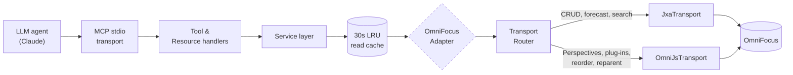

# omnifocus-mcp

[](./SPEC.md)
[](./LICENSE)
[](./package.json)
[](https://www.apple.com/macos/)
[](https://www.conventionalcommits.org)

> **An MCP server exposing the full OmniFocus surface to LLM agents.** Ask Claude or any MCP-compatible client to read, query, create, and modify your OmniFocus tasks, projects, tags, perspectives, and attachments — through 50 typed tools, built to a "single-user local-first" standard with engineering excellence as a first-class goal.

---

## Table of contents

- [What it is](#what-it-is)
- [Quick start](#quick-start)
- [Example interactions](#example-interactions)
- [If you are an AI agent](#if-you-are-an-ai-agent)
- [Tools](#tools)
- [Resources](#resources)
- [Transport text DSL](#transport-text-dsl)
- [Architecture at a glance](#architecture-at-a-glance)
- [Status and roadmap](#status-and-roadmap)
- [Install](#install)
- [Environment variables](#environment-variables)
- [Troubleshooting](#troubleshooting)
- [Client setup guides](#client-setup-guides)
- [Design documents](#design-documents)
- [Project conventions](#project-conventions)
- [Contributing](#contributing)
- [License](#license)

---

## Quick start

1. **Install**
   ```bash
   npm install -g @torsday/omnifocus-mcp
   ```

2. **Connect Claude Desktop** — add to `~/Library/Application Support/Claude/claude_desktop_config.json`:
   ```json
   {
     "mcpServers": {
       "omnifocus": {
         "command": "omnifocus-mcp",
         "args": [],
         "env": { "OMNIFOCUS_LOG_LEVEL": "info" }
       }
     }
   }
   ```

3. **Connect Claude Code**:
   ```bash
   claude mcp add omnifocus omnifocus-mcp
   ```

4. **Grant macOS Automation permission** on first use — Claude will prompt to control OmniFocus; click **OK**. If denied by mistake: **System Settings → Privacy & Security → Automation → [app] → OmniFocus** ✓

5. **Verify** — ask Claude: *"Use the internal_status tool and tell me what it returns."*

Detailed per-client guides live in [`docs/clients/`](./docs/clients/).

---

## What it is

`omnifocus-mcp` is an MCP (Model Context Protocol) server that gives any MCP-compatible client — Claude Desktop, Claude Code, or any stdio-speaking agent — full, typed, audited access to OmniFocus on macOS.

- **Full coverage.** Tasks, projects, tags, folders, perspectives (built-in and custom), forecast, review, notes, attachments, batch operations, import/export, sync.
- **Two transports, one interface.** JXA via `osascript` for the majority of OmniFocus operations; OmniJS via `Application("OmniFocus").evaluateJavascript()` for custom perspectives, plug-ins, task reordering, and reparenting. A `TransportRouter` picks per operation; services never see the transport.
- **Typed everything.** Zod at the API boundary, branded opaque IDs, ISO-8601 with offset dates, discriminated error hierarchy.
- **Agent-aware.** Every tool description follows the [`agent_systems.md`](https://github.com/torsday/llm_prompts/blob/main/agent_systems.md) "what / when not / returns / side effects" standard. Errors carry `{ code, message, suggestion, details }` so agents know what to do next.
- **Safe by default.** No network surface, no stdout writes (MCP uses stdio), opt-in escape hatches, circuit breakers, rate limits, write serialization.

## Example interactions

These show the kind of work you can ask Claude to do once omnifocus-mcp is connected.

---

**"What's in my inbox right now?"**

Claude calls `task_list` with `{ "available": true, "limit": 20 }` and returns a formatted list of actionable inbox tasks with their IDs, due dates, and flags.

---

**"Create a task to 'review Q2 budget' due Friday, flagged, in the Finance project."**

1. Claude calls `project_list` to find the Finance project ID.
2. Calls `task_create` with `{ "name": "review Q2 budget", "projectId": "<id>", "dueDate": "end-of-week", "flagged": true }`.
3. Returns the created task with its persistent ID and confirms the due date resolved to the correct Friday.

---

**"Mark all my overdue tasks as deferred to tomorrow."**

1. Claude calls `task_list` with `{ "dueBefore": "today", "available": true }` to find overdue items.
2. For each task, calls `task_update` with `{ "deferDate": "tomorrow" }`.
3. Reports a summary: *"Deferred 7 overdue tasks to tomorrow. Call sync_trigger if you want iCloud to update immediately."*

---

**"Show me what's due this week in the Work perspective."**

1. Claude calls `perspective_list` to find the "Work" perspective ID.
2. Calls `perspective_evaluate` with `{ "perspectiveId": "<id>" }` to get tasks in that perspective.
3. Filters and presents items with due dates within the current week.

---

## If you are an AI agent

This section is written for you. It covers the conventions you need to use this MCP effectively without trial and error.

### IDs, not names

Every OmniFocus resource — tasks, projects, tags, folders — is identified by a **persistent opaque ID** (e.g. `"hKx9vLmNp2"`). Names collide and change; IDs don't. Always resolve names to IDs with the corresponding `*_list` tool before calling any other tool.

### Error codes and what to do next

Every error carries a stable `code`, a human-readable `suggestion`, and a machine-readable `remediationClass`:

| `remediationClass` | Meaning | Your action |
|--------------------|---------|-------------|
| `environment` | OmniFocus is not running, permissions denied, or a Pro/version feature is missing | Stop. Surface `suggestion` to the user; do not retry automatically |
| `input` | Bad ID, invalid field value, or schema violation | Fix the input using `details` for specifics; retry |
| `transient` | Timeout, rate limit, queue full, or circuit open | Wait `details.retryAfterMs` ms, then retry once |
| `infrastructure` | JXA or OmniJS script failed | Retry once; if still failing, surface to user |
| `lifecycle` | Server is shutting down | Reconnect to a fresh server instance |

`RateLimited` and `CircuitOpen` always include `details.retryAfterMs` (default `60000` ms). Do not poll faster than that.

### Dates

All date inputs accept either **ISO-8601 with UTC offset** (`"2026-04-22T09:00:00-07:00"`) or a **relative shortcut**:

`today` · `tomorrow` · `yesterday` · `this-week` · `next-week` · `end-of-week` · `end-of-month`

Shortcuts resolve to midnight in the server's local timezone.

### Mutations and sync

Every write tool returns the full updated domain object, not just an acknowledgement. The response `meta.syncPending` is `true` immediately after a write — OmniFocus has saved locally but not yet synced to iCloud. Call `sync_trigger` if cross-device visibility matters; otherwise the sync happens automatically within a few minutes.

### Null consistency

All optional scalar fields are **always present** in responses, set to `null` when unset. You can safely destructure without null-checks on field presence.

### Idempotency — safe retries

`project_create`, `project_update`, and `project_delete` accept an optional `idempotency_key?: string`. If you supply one and the call succeeds, replaying the exact same key within 5 minutes returns the cached result with `meta.idempotentReplay: true` and skips the OmniFocus call. Use a deterministic key scoped to your session and intent (e.g. `"session-abc/create-project-finance"`).

### Dry-run — validate before committing

`task_update` and `project_update` accept `dry_run?: boolean`. When `true`, input is fully validated and the would-be result is returned, but nothing is written to OmniFocus. `meta.dryRun: true` is set on the response. Use this to confirm inputs before destructive operations.

### Additive tag edits — no read-modify-write needed

`task_update` accepts `addTags`, `removeTags`, and `setFlagged` patch fields alongside the existing full-replacement `tagIds` field. Prefer these for incremental edits — they apply a diff atomically inside the write queue with no race against concurrent user edits.

### Conflict detection — optimistic concurrency

`task_update` accepts `expectedModifiedAt`. If the task was modified since your read, the server returns `OF_CONFLICT` (`remediationClass: "input"`). Re-read with `task_get`, merge your changes, and retry with the fresh `modifiedAt`.

### Capabilities pre-flight

Read `omnifocus://capabilities` once at session start. It returns OF version, edition (Standard/Pro), transport availability, and feature flags (`customPerspectives`, `forecastTag`, `rawScriptTools`). Use it to skip Pro-gated tools rather than discovering unavailability via error.

### Rate limit state — self-throttle before hitting the wall

Every response includes `meta.rateLimit?: { remaining: number; resetAt: string }`. Check this after each call. If `remaining < 10`, slow down. If `remaining === 0`, do not call before `meta.rateLimit.resetAt`. The default limit is 120 calls/min per tool.

### Structured warnings — act on `meta.warnings[].code`

Non-fatal issues appear in `meta.warnings` as `{ code, message, suggestion?, details? }`. Switch on `code`, not `message`:

| `code` | Means | Action |
|---|---|---|
| `WARN_IDS_NOT_FOUND` | Some IDs in a bulk call were not found | Check `details.missing` |
| `WARN_RESULT_TRUNCATED` | Response hit size limit; more items exist | Follow pagination cursor |
| `WARN_SYNC_PENDING` | Write saved locally; iCloud sync not yet triggered | Call `sync_trigger` if needed |

### Incremental sync — `updatedSince`

`task_list` accepts `updatedSince?: string` (ISO-8601 or relative shortcut). Use it to fetch only changed items after your initial load:

```jsonc
// First call: full load
{ "available": true, "limit": 200 }

// Subsequent calls: only changes
{ "available": true, "updatedSince": "2026-04-21T10:00:00-07:00", "limit": 200 }
```

Note: deleted items cannot be surfaced via `updatedSince` — compare `meta.snapshot` counts if you need to detect deletions.

### Navigation hints — follow `_links`

Every `Task` response includes `_links` with resource URIs for related objects:

```jsonc
{
  "id": "hKx9vLmNp2",
  "_links": {
    "self": "omnifocus://task/hKx9vLmNp2",
    "project": "omnifocus://project/pXY3",
    "tags": ["omnifocus://tag/tABC"]
  }
}
```

Pass the ID fragment to `task_get`, `project_get`, etc. You never need to construct a URI manually.

### Response envelope

All responses have this shape:

```jsonc
// success
{ "data": { … }, "meta": { "correlationId": "…", "durationMs": 12, "cacheHit": false, "transport": "jxa", "syncPending": false } }

// error
{ "error": { "code": "OF_NOT_FOUND", "remediationClass": "input", "message": "…", "suggestion": "…", "details": { … } }, "meta": { … } }
```

### Where to start

- **Daily work**: `task_list` (inbox or today filter) → `task_create` / `task_update` / `task_complete`
- **Projects**: `project_list` → `project_create` / `project_update`
- **Finding things**: `task_search` or `search_query`; `tag_list` for available tags
- **Sync**: `sync_trigger` after bulk mutations; `internal_status` to check server health

---

## Tools

50 tools are registered, organized by domain. See [`docs/tools.md`](./docs/tools.md) for the full auto-generated reference with input schemas, example calls, and example responses.

### App lifecycle
| Tool | Description |
|---|---|
| `app_launch` | Explicitly launch OmniFocus (idempotent) |

### Tasks
| Tool | Description |
|---|---|
| `task_list` | List tasks with filters (available, flagged, due, project, tag, updatedSince) |
| `task_get` | Get a single task by ID |
| `task_get_many` | Get multiple tasks by ID in one call |
| `task_create` | Create a task (project, tags, due, defer, flag, note, repeat) |
| `task_update` | Update a task (addTags/removeTags, dry_run, expectedModifiedAt) |
| `task_complete` | Mark a task complete |
| `task_delete` | Delete a task |
| `task_move` | Reparent a task to a different project or parent task |
| `task_reorder` | Reorder a task among its siblings |
| `task_duplicate` | Duplicate a task (optionally recursive) |
| `task_find_by_name` | Find tasks by exact or fuzzy name match |
| `task_search` | Full-text search across task names and notes |
| `task_set_repetition` | Set a repeat rule on a task |
| `task_clear_repetition` | Remove a repeat rule from a task |
| `task_parse_transport_text` | Parse transport text DSL → structured tasks (no side effects) |
| `task_batch_create` | Create up to 50 tasks atomically |
| `task_batch_update` | Update up to 50 tasks atomically |
| `task_batch_complete` | Complete up to 50 tasks atomically |

### Projects
| Tool | Description |
|---|---|
| `project_list` | List projects with filters (folder, status) |
| `project_get` | Get a single project by ID |
| `project_create` | Create a project (idempotency_key supported) |
| `project_update` | Update a project (dry_run, idempotency_key, expectedModifiedAt) |
| `project_complete` | Mark a project complete |
| `project_delete` | Delete a project (idempotency_key supported) |
| `project_move` | Move a project to a different folder |
| `project_mark_reviewed` | Mark a project as reviewed |
| `project_list_due_for_review` | List projects whose next review date is today or past |
| `project_set_review_interval` | Set the review interval (days) for a project |

### Folders
| Tool | Description |
|---|---|
| `folder_list` | List folders |
| `folder_get` | Get a single folder by ID |
| `folder_create` | Create a folder |
| `folder_update` | Rename a folder |
| `folder_delete` | Delete a folder |
| `folder_move` | Move a folder to a parent folder |

### Tags
| Tool | Description |
|---|---|
| `tag_list` | List tags |
| `tag_get` | Get a single tag by ID |
| `tag_create` | Create a tag |
| `tag_update` | Rename a tag |
| `tag_delete` | Delete a tag |
| `tag_move` | Move a tag under a parent tag |
| `tag_set_status` | Set tag status (active/on-hold/dropped) |
| `tag_set_allows_next_action` | Toggle "allows next action" on a tag |
| `tag_get_location` | Get a tag's location in the hierarchy |
| `tag_set_location` | Set a tag's location in the hierarchy |

### Notes
| Tool | Description |
|---|---|
| `note_get` | Get a task or project note (plain text) |
| `note_get_html` | Get a task or project note (HTML) |
| `note_set` | Set a task or project note (plain text, replaces) |
| `note_set_html` | Set a task or project note (HTML, replaces) |
| `note_append` | Append text to a task or project note |

### Attachments
| Tool | Description |
|---|---|
| `attachment_list` | List attachments on a task or project |
| `attachment_add` | Embed a local file as an attachment |
| `attachment_remove` | Remove an attachment by ID |
| `attachment_save_to_path` | Save an attachment's bytes to a local file |

### Perspectives
| Tool | Description |
|---|---|
| `perspective_list` | List all perspectives (built-in and custom) |
| `perspective_evaluate` | Evaluate a perspective and return its tasks |

### Forecast & search
| Tool | Description |
|---|---|
| `forecast_get` | Get today's forecast grouped by overdue / due today / due later / inbox |
| `search_query` | Full-text search across tasks and projects |

### Sync & app
| Tool | Description |
|---|---|
| `sync_trigger` | Trigger an OmniFocus iCloud sync |
| `sync_status` | Get the last sync timestamp and status |

### Plug-ins
| Tool | Description |
|---|---|
| `plugin_invoke` | Invoke an installed Omni Automation plug-in by bundle identifier |

### Export
| Tool | Description |
|---|---|
| `export_opml` | Export a project (or all projects) as OPML |

### Observability
| Tool | Description |
|---|---|
| `internal_status` | Server health: transport status, queue depths, cache stats, rate limits |

### Raw scripts _(opt-in, off by default)_
| Tool | Description |
|---|---|
| `run_jxa_script` | Execute arbitrary JXA — requires `OMNIFOCUS_ALLOW_RAW_SCRIPT=1` |
| `run_omnijs_script` | Execute arbitrary OmniJS — requires `OMNIFOCUS_ALLOW_RAW_SCRIPT=1` |

---

## Resources

Ten MCP resources are registered under the `omnifocus://` scheme. Resources are read-only, URI-addressable, and enumerable via `resources/list`.

| URI | Returns |
|---|---|
| `omnifocus://capabilities` | Server capabilities: OF version, edition, transport status, feature flags |
| `omnifocus://snapshot` | Five-count orientation object: inbox, flagged, overdue, dueToday, projectsDueForReview |
| `omnifocus://inbox` | Inbox tasks as `Task[]` |
| `omnifocus://forecast/today` | Today's forecast grouped by overdue / due today / due later / inbox |
| `omnifocus://overdue` | All overdue tasks sorted by dueDate ASC |
| `omnifocus://flagged` | All flagged available tasks |
| `omnifocus://review-due` | Projects with nextReviewDate ≤ today |
| `omnifocus://project/{id}` | Single project + full task tree |
| `omnifocus://tag/{id}` | Single tag + its tasks |
| `omnifocus://perspective/{id}` | Perspective evaluation result (same shape as `perspective_evaluate`) |

---

## Transport text DSL

`task_parse_transport_text` parses a lightweight DSL inspired by OmniFocus Mail Drop into structured task objects. **No tasks are created** — pass the returned `tasks[]` to `task_create` or `task_batch_create` separately.

### Token syntax

| Token | Example | Meaning |
|---|---|---|
| `@tag` | `@work` | Assign a tag by name |
| `#date` | `#2026-05-01` or `#today` | Due date |
| `::date` | `::tomorrow` | Defer date |
| `!!` | `!!` | Flag the task |
| `//text` | `//Call back before noon` | Append as task note |
| `Project: Name` | `Project: Finance` | Set project context for subsequent tasks |

### Date shortcuts

`today` · `tomorrow` · `yesterday` — resolved to midnight local time.

Full ISO-8601 dates (`YYYY-MM-DD`) are also accepted. Unparseable dates emit a `warnings[]` entry.

### Examples

```
Project: Work
Prepare Q2 report @work #end-of-week !!
Send draft to Alice @work @email #tomorrow //attach spreadsheet
Follow up with Bob ::next-week

Project: Personal
Buy groceries @errands #today
Call dentist @phone ::tomorrow !! //ask about X-ray appointment
```

Parsing the above returns:

```jsonc
{
  "tasks": [
    { "name": "Prepare Q2 report", "tagNames": ["work"], "dueDate": "2026-05-02T00:00:00-07:00", "flagged": true, "projectName": "Work" },
    { "name": "Send draft to Alice", "tagNames": ["work", "email"], "dueDate": "2026-04-26T00:00:00-07:00", "note": "attach spreadsheet", "projectName": "Work" },
    { "name": "Follow up with Bob", "deferDate": "2026-04-28T00:00:00-07:00", "projectName": "Work" },
    { "name": "Buy groceries", "tagNames": ["errands"], "dueDate": "2026-04-25T00:00:00-07:00", "projectName": "Personal" },
    { "name": "Call dentist", "tagNames": ["phone"], "deferDate": "2026-04-26T00:00:00-07:00", "flagged": true, "note": "ask about X-ray appointment", "projectName": "Personal" }
  ],
  "count": 5,
  "warnings": []
}
```

Tag names and project names are raw strings — resolve to IDs with `tag_list` and `project_list` before passing to `task_create`.

---

## Architecture at a glance



The full layered diagram with the in-memory test adapter, queues, and circuit breakers lives in [`DESIGN.md §6`](./DESIGN.md#6-architecture).

## Status and roadmap

All six milestones are implemented. The server is feature-complete and pre-release (pending v1.0.0 tag):

| Phase | Milestone | Status |
|---|---|---|
| M0 | Foundation + both transports | ✅ Done |
| M1 | Core task & project surface | ✅ Done |
| M2 | Metadata + perspectives (OmniJS) | ✅ Done |
| M3 | Advanced (repeat, notes, review, batch, DSL) | ✅ Done |
| M4 | Long tail (attachments, OPML, sync, plug-ins, raw scripts) | ✅ Done |
| M5 | Polish & release (observability, E2E, CI, docs, npm) | 🔄 In progress |

Track live progress on the [**GitHub Project board**](https://github.com/users/torsday/projects/4). The remaining work before v1.0.0 is tracked in [GitHub Issues](https://github.com/torsday/omnifocus-mcp/issues).

## Install

```bash
# Claude Desktop — add to ~/Library/Application Support/Claude/claude_desktop_config.json
{
  "mcpServers": {
    "omnifocus": {
      "command": "npx",
      "args": ["-y", "@torsday/omnifocus-mcp"],
      "env": { "OMNIFOCUS_LOG_LEVEL": "info" }
    }
  }
}

# Claude Code
claude mcp add omnifocus -- npx -y @torsday/omnifocus-mcp

# Or run standalone
npm install -g @torsday/omnifocus-mcp
omnifocus-mcp
```

On first run, macOS asks permission for Claude to automate OmniFocus. Click **OK**. If you denied it by mistake: **System Settings → Privacy & Security → Automation → [app] → OmniFocus** ✓. See the [troubleshooting guide](./docs/troubleshooting.md) and the per-client guides in [`docs/clients/`](./docs/clients/) for step-by-step recovery.

## Environment variables

| Variable | What | Default |
|---|---|---|
| `OMNIFOCUS_LOG_LEVEL` | `trace`\|`debug`\|`info`\|`warn`\|`error` — logs go to stderr | `info` |
| `OMNIFOCUS_CACHE_TTL_MS` | Read-cache TTL in milliseconds | `30000` |
| `OMNIFOCUS_READ_POOL_SIZE` | Concurrent `osascript` processes for reads | `2` |
| `OMNIFOCUS_WRITE_QUEUE_CAP` | Max pending writes before `QueueFull` error | `50` |
| `OMNIFOCUS_JXA_TIMEOUT_MS` | Per-call JXA hard timeout in milliseconds | `30000` |
| `OMNIFOCUS_OMNIJS_TIMEOUT_MS` | Per-call OmniJS hard timeout in milliseconds | `45000` |
| `OMNIFOCUS_ATTACHMENT_PATHS` | Colon-separated allowlist of absolute path prefixes for attachment ops | `$HOME` |
| `OMNIFOCUS_MAX_ATTACHMENT_MB` | Maximum attachment file size in MB (0 = no cap) | `100` |
| `OMNIFOCUS_TOOL_RATE_LIMIT` | Per-tool rate limit in `N/SECONDS` format | `120/60` |
| `OMNIFOCUS_ALLOW_RAW_SCRIPT` | Set to `1` to register `run_jxa_script` / `run_omnijs_script` | unset |
| `OMNIFOCUS_INTEGRATION` | Set to `1` to enable the integration test suite | unset |

Full table with override semantics: [`DESIGN.md §22`](./DESIGN.md#22-configuration--environment).

### Running integration tests

Integration tests run against a live OmniFocus install. Before running them, seed the fixture database:

```bash
# 1. Make sure OmniFocus is running and Automation permission is granted
# 2. Seed fixture data (idempotent — safe to re-run):
node scripts/seed-integration-db.js

# Optional: wipe and re-create all fixtures from scratch:
node scripts/seed-integration-db.js --clean

# 3. Run the integration suite:
OMNIFOCUS_INTEGRATION=1 pnpm test:integration
```

The seed script creates a set of tagged `mcp-fixture:` items (folders, projects, tasks, tags) that integration tests rely on. Re-running the script without `--clean` skips items that already exist.

---

## Troubleshooting

### OmniFocus is not running

**Error:** `OF_NOT_RUNNING` — OmniFocus must be open for most operations.

**Fix:** Launch OmniFocus manually, or call `app_launch` to open it via MCP.

---

### macOS Automation permission denied

**Symptom:** Every tool call returns `PermissionDenied` / `OF_PERMISSION_DENIED`. This happens when the shell process running omnifocus-mcp was denied Automation access to OmniFocus.

**Fix:**
1. Open **System Settings → Privacy & Security → Automation**.
2. Find the app running the MCP server (Terminal, Claude Desktop, or the shell used by your CI runner).
3. Enable the **OmniFocus** checkbox.
4. Restart omnifocus-mcp.

You can verify permission is granted with:
```bash
bash scripts/check-automation-permission.sh
```

---

### First-call timeout / slow startup

JXA starts an `osascript` subprocess on each call. The first call after a system sleep or a fresh OmniFocus launch can take 5–15 seconds while the database loads. This is normal.

If calls consistently time out, increase the timeout:
```bash
OMNIFOCUS_JXA_TIMEOUT_MS=60000 omnifocus-mcp
```

---

### `run_jxa_script` / `run_omnijs_script` not available

**Error:** `ValidationError: run_jxa_script is not available in this adapter configuration`

**Fix:** The raw-script tools are off by default. Start the server with:
```bash
OMNIFOCUS_ALLOW_RAW_SCRIPT=1 omnifocus-mcp
```

See [`docs/adr/0004-raw-script-escape-hatch.md`](./docs/adr/0004-raw-script-escape-hatch.md) for the security rationale.

---

### Stale data after a write

Writes are saved locally and show up immediately in subsequent tool calls. However, changes don't reach other devices until iCloud sync runs. Call `sync_trigger` after bulk mutations or when cross-device visibility matters.

---

### More help

- [`docs/troubleshooting.md`](./docs/troubleshooting.md) — expanded troubleshooting guide
- [`docs/clients/`](./docs/clients/) — per-client setup (Claude Desktop, Claude Code, generic stdio)

---

## Client setup guides

Step-by-step setup, environment variable reference, macOS Automation permission walkthrough, and troubleshooting for each client target:

| Client | Guide |
|---|---|
| Claude Desktop | [`docs/clients/claude-desktop.md`](./docs/clients/claude-desktop.md) |
| Claude Code (CLI) | [`docs/clients/claude-code.md`](./docs/clients/claude-code.md) |
| Generic stdio client | [`docs/clients/generic-stdio.md`](./docs/clients/generic-stdio.md) |

## Design documents

- **[`SPEC.md`](./SPEC.md)** — functional scope and non-functional requirements; resolved v1 decisions
- **[`DESIGN.md`](./DESIGN.md)** — 28-section architecture; options evaluated; R/S/M assessment; example tool implementation
- **[`docs/security.md`](./docs/security.md)** — attack surface, mitigations, and test coverage
- **[GitHub Issues](https://github.com/torsday/omnifocus-mcp/issues)** + **[Project #4](https://github.com/users/torsday/projects/4)** — live backlog, dependencies, and status
- **[`docs/domain-reference.md`](./docs/domain-reference.md)** — OmniFocus glossary, canonical schemas, lossiness matrix for export/import
- **[`docs/adr/`](./docs/adr/)** — Architecture Decision Records covering every load-bearing choice:

| # | Decision |
|---|---|
| [0001](./docs/adr/0001-language-and-runtime.md) | TypeScript on Node.js 20 LTS |
| [0002](./docs/adr/0002-omnifocus-transport-dual.md) | JXA + OmniJS dual transport |
| [0003](./docs/adr/0003-tool-surface-namespaced.md) | `<noun>_<verb>` tool namespacing |
| [0004](./docs/adr/0004-raw-script-escape-hatch.md) | Opt-in raw-script tools |
| [0005](./docs/adr/0005-script-assets-as-files.md) | Scripts as first-class files |
| [0006](./docs/adr/0006-read-cache-strategy.md) | 30s LRU, invalidate-on-write |
| [0007](./docs/adr/0007-dates-iso8601-with-offset.md) | ISO-8601 with offset at the boundary |
| [0008](./docs/adr/0008-ids-branded-opaque-strings.md) | Branded opaque ID types |
| [0009](./docs/adr/0009-concurrency-pool-and-queue.md) | Read pool + write queue + OmniJS queue |
| [0010](./docs/adr/0010-mcp-transport-stdio.md) | stdio-only MCP transport (v1) |
| [0011](./docs/adr/0011-versioning-and-stability.md) | Semver with explicit contract |
| [0012](./docs/adr/0012-distribution-npx.md) | Distribution via `npx` / npm |
| [0013](./docs/adr/0013-tool-response-envelope.md) | Uniform response envelope |

## Project conventions

Project conventions (adapter seam, script-asset discipline, ID-only lookups, date contract, cache invalidation, attachments-by-path) live in [`CLAUDE.md`](./CLAUDE.md). Any contribution follows the standards from [`coding.md`](https://github.com/torsday/llm_prompts/blob/main/coding.md), [`systems_design.md`](https://github.com/torsday/llm_prompts/blob/main/systems_design.md), and [`agent_systems.md`](https://github.com/torsday/llm_prompts/blob/main/agent_systems.md).

## Contributing

This is a single-developer project; external contributions are not currently solicited. The design, ADRs, and task backlog are nevertheless public so the work is inspectable and forkable. See [`CONTRIBUTING.md`](./CONTRIBUTING.md) for the patterns any contribution would need to follow.

## License

[MIT](./LICENSE) — see full text in `LICENSE`.
