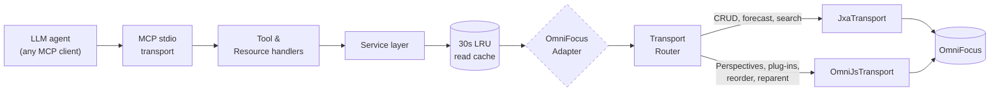

# omnifocus-mcp

[](https://www.npmjs.com/package/@torsday/omnifocus-mcp)
[](https://github.com/torsday/omnifocus-mcp/actions/workflows/ci.yml?query=branch%3Amain)
[](./LICENSE)
[](./package.json)
[](https://www.apple.com/macos/)
[](./docs/adr/0017-mutation-testing-release-gate.md)

> **Give any MCP-compatible AI assistant full, typed access to your OmniFocus.** Read your inbox, create tasks, close projects, batch-update dozens of items, evaluate perspectives, trigger sync — all through natural language. `omnifocus-mcp` wires an 80-tool MCP server directly to OmniFocus on macOS via JXA and OmniJS, with circuit breakers, rate limits, and an agent-aware error hierarchy so the assistant knows exactly what to do next when something goes wrong.

---

## Table of contents

- [Agent-native OmniFocus — beyond the app surface](#agent-native-omnifocus--beyond-the-app-surface)
- [Why this exists](#why-this-exists)
- [Quick start](#quick-start)
- [Security & trust](#security--trust)
- [Example interactions](#example-interactions)
- [Prompts](#prompts)
- [If you are an AI agent](#if-you-are-an-ai-agent)
- [Tools](#tools)
- [Resources](#resources)
- [Transport text DSL](#transport-text-dsl)
- [Architecture at a glance](#architecture-at-a-glance)
- [Status and roadmap](#status-and-roadmap)
- [Install](#install)
- [Environment variables](#environment-variables)
- [Troubleshooting](#troubleshooting)
- [Client setup guides](#client-setup-guides)
- [Design documents](#design-documents)
- [Contributing](#contributing)
- [License](#license)

---

## Agent-native OmniFocus — beyond the app surface

A plain MCP wrapper would be a one-to-one mirror of the OmniFocus app. This server is more than that. It exposes a small set of capabilities that exist *because* an LLM is the caller — capabilities the app itself doesn't ship and probably never will, because they're only worth the effort when the consumer is an agent that can reason over structured input and act on the result.

These are the agent-native capabilities, framed in the user outcome they enable:

- **Stalled-project triage** — `omnifocus://project-health` returns granular signals (last activity, available task count, deferred-future tasks, review-overdue) so an agent can identify projects worth a status nudge without the user opening the app. Mechanical aggregation; the app could do it but doesn't.
- **Semantic dedupe** — [`task_find_similar`](docs/tools.md#task_find_similar) does lexical similarity search across task names so an agent confirms intent ("is this a duplicate of X?") before creating a new task. Possible without an LLM, but only useful with one in the loop.
- **Taxonomy audit** — `omnifocus://taxonomy-audit` flags inconsistent tag/folder usage so an agent can propose cleanup grounded in the actual structure of the database. Mechanical.
- **NL perspective authoring** *(in development — [#476](https://github.com/torsday/omnifocus-mcp/issues/476))* — describe a perspective in prose; the agent compiles a rule tree and writes it via `perspective_create`. Exists *because* of the agent — the rule tree is a non-trivial structure most users won't compose by hand.
- **Time-budget reconciliation** — [`forecast_pack`](docs/tools.md#forecast_pack) takes a daily minute budget and packs the forecast into it, surfacing overloaded days. Asking "I have 90 minutes, what should I do?" gets a structured answer.
- **Retrospective resource** — `omnifocus://retrospective?from=…&to=…` aggregates the closed-task surface so an agent can write the user's weekly review against real data instead of asking them to recap.
- **Project templates** — [`project_template_save`](docs/tools.md#project_template_save) / [`_instantiate`](docs/tools.md#project_template_instantiate) capture and replay project structures with parameter substitution and date shifting. The agent fills the parameters from conversation context.
- **Inbox-triage prompt** — the bundled `inbox-triage` MCP prompt sequences the tool calls for a full GTD-style processing sweep. Intentionally a prompt, not a tool — the value is in orchestrating the existing surface.
- **Calendar + agenda** — `omnifocus://calendar` and `omnifocus://agenda` merge macOS Calendar events with the OF forecast so an agent can answer "what does my day actually look like?" without the user holding two windows side by side.

> **How this is different from a plain wrapper.** A wrapper exposes the app's verbs. This server adds verbs the app doesn't have, because LLMs change what's worth building. Some of the additions (project-health, taxonomy-audit) are mechanical aggregations the app *could* ship and never has — they sit unbuilt because no human wants to click through them. Others (NL perspective authoring, semantic dedupe, time-budget reconciliation) are only valuable with an LLM in the call path. Both kinds belong here. The split is honest: don't pretend the mechanical stuff is novel, and don't pretend the agent-only stuff is just sugar.

---

## Why this exists

OmniFocus is a powerful GTD tool, but it's an island. Your tasks sit there while you context-switch between your AI assistant and your task manager, manually copy-pasting notes, updating projects, and trying to keep everything in sync with your actual work.

`omnifocus-mcp` removes that friction. With it connected, your AI assistant can:

- **Capture** — turn a conversation into tasks directly in OmniFocus, with the right project, tags, due dates, and notes, without you touching the app
- **Review** — pull today's overdue items, this week's forecast, or a full project breakdown into context so the assistant can reason about your workload alongside your work
- **Maintain** — batch-defer a pile of overdue tasks, complete a sprint's worth of items, reorganize projects after a meeting debrief
- **Reflect** — ask "what's in my inbox right now?" or "what projects haven't been reviewed in a month?" and get structured, actionable answers

The server is built to a single-user local-first standard: no network surface, no cloud sync, typed errors with agent-readable remediation hints, safe by default.

---

## Quick start

1. **Install**
   ```bash
   # Homebrew (no Node required)
   brew install torsday/tap/omnifocus-mcp

   # or npm
   npm install -g @torsday/omnifocus-mcp
   ```

2. **Configure your MCP client.** Every client uses the same `command` + `args` + `env` shape — only the file path and serialization (JSON vs TOML) differ. The universal shape:

   ```text
   command: omnifocus-mcp
   args:    (none)
   env:     OMNIFOCUS_LOG_LEVEL=info   # optional; "debug" is verbose
   ```

   Find your client below. Order is alphabetical; no client is recommended over another.

   <details>
   <summary><strong>Claude Code</strong> (CLI; no file edit)</summary>

   ```bash
   claude mcp add omnifocus omnifocus-mcp
   ```

   Detailed guide: [`docs/clients/claude-code.md`](./docs/clients/claude-code.md)
   </details>

   <details>
   <summary><strong>Claude Desktop</strong> — <code>~/Library/Application Support/Claude/claude_desktop_config.json</code> (JSON)</summary>

   ```json
   {
     "mcpServers": {
       "omnifocus": {
         "command": "omnifocus-mcp",
         "args": [],
         "env": { "OMNIFOCUS_LOG_LEVEL": "info" }
       }
     }
   }
   ```

   Detailed guide: [`docs/clients/claude-desktop.md`](./docs/clients/claude-desktop.md)
   </details>

   <details>
   <summary><strong>Cline</strong> (VS Code extension) — extension settings (JSON)</summary>

   In VS Code, open the Cline extension's MCP settings panel and add:

   ```json
   {
     "mcpServers": {
       "omnifocus": {
         "command": "omnifocus-mcp",
         "args": [],
         "env": { "OMNIFOCUS_LOG_LEVEL": "info" }
       }
     }
   }
   ```

   Cline's settings UI may surface the same fields as labelled inputs rather than raw JSON; the values are identical. Verify the panel location against the current Cline docs.
   </details>

   <details>
   <summary><strong>OpenAI Codex CLI</strong> — <code>~/.codex/config.toml</code> (TOML)</summary>

   ```toml
   [mcp_servers.omnifocus]
   command = "omnifocus-mcp"
   args = []
   env = { OMNIFOCUS_LOG_LEVEL = "info" }
   ```

   Detailed guide: [`docs/clients/codex.md`](./docs/clients/codex.md)
   </details>

   <details>
   <summary><strong>Cursor</strong> — <code>~/.cursor/mcp.json</code> (JSON)</summary>

   ```json
   {
     "mcpServers": {
       "omnifocus": {
         "command": "omnifocus-mcp",
         "args": [],
         "env": { "OMNIFOCUS_LOG_LEVEL": "info" }
       }
     }
   }
   ```

   Verify the path against the current Cursor docs — recent versions also accept project-scoped `.cursor/mcp.json` at the repo root.
   </details>

   <details>
   <summary><strong>Windsurf</strong> — <code>~/.codeium/windsurf/mcp_config.json</code> (JSON)</summary>

   ```json
   {
     "mcpServers": {
       "omnifocus": {
         "command": "omnifocus-mcp",
         "args": [],
         "env": { "OMNIFOCUS_LOG_LEVEL": "info" }
       }
     }
   }
   ```

   Verify the path against the current Windsurf docs — Codeium occasionally relocates config under `~/.codeium/`.
   </details>

   <details>
   <summary><strong>Generic stdio client</strong> (anything else that speaks MCP/stdio)</summary>

   Use your client's MCP config form. The shape is:

   ```text
   command: "omnifocus-mcp"
   args:    []
   env:     { "OMNIFOCUS_LOG_LEVEL": "info" }
   ```

   Detailed guide: [`docs/clients/generic-stdio.md`](./docs/clients/generic-stdio.md)
   </details>

3. **Grant macOS Automation permission** on first use — the app running the MCP server will prompt to control OmniFocus; click **OK**. If denied by mistake: **System Settings → Privacy & Security → Automation → [app] → OmniFocus** ✓

4. **Verify** — ask your assistant: *"Use the internal_status tool and tell me what it returns."*

Detailed per-client guides: [`docs/clients/`](./docs/clients/)

---

## Security & trust

`omnifocus-mcp` is a **local-only** Node.js process that drives a **local** OmniFocus app via Apple's `osascript` runtime. Installing this package does not introduce cloud connectivity, telemetry, or network egress that wasn't already on your machine.

### Data flow

```
OmniFocus DB (local) ─→ JXA / OmniJS via osascript (local) ─→ MCP server (local stdio)
                                                                    │
                                                                    ↓
                                                       MCP client (local)
                                                                    │
                                                                    ↓
                                                  LLM provider (only if your client uses one)
```

The LLM hop at the bottom is **your client's** choice, not this package's. If you run a local-only client (or a client configured to use a local model), nothing in this stack reaches the network.

### Hard guarantees

Each guarantee is enforced by code, not by promise. Click through to verify.

- **No network I/O at the source level** — a custom lint rule (`no-network-import`) bans `import` of `node:http`, `node:https`, `node-fetch`, `axios`, `undici`, and `cross-fetch`. CI fails on any new import that would enable network calls. See [`src/linting/customRules.ts` Rule 4](./src/linting/customRules.ts).
- **No stdout writes outside the MCP framing path** — `installStdoutGuard()` proxies `process.stdout.write` at server boot and rejects any write that wouldn't corrupt MCP's JSON-RPC stream. The contract is pinned by [`src/server/stdoutGuard.test.ts`](./src/server/stdoutGuard.test.ts).
- **No telemetry / analytics** — production [`dependencies` in `package.json`](./package.json) are six packages: `@modelcontextprotocol/sdk`, `lru-cache`, `pino`, `ulid`, `zod`, `zod-to-json-schema`. No analytics SDK; nothing phones home.
- **No `postinstall` / `preinstall` scripts** — `package.json` ships with one lifecycle script (`prepublishOnly`) and one dev hook (`prepare` for git hooks). Neither runs when a downstream consumer installs the package.
- **Config secrets redacted from logs** — the boot-time `server.started` event runs config through [`redactConfig`](./src/config/env.ts) before logging; path-shaped values are sha256-hashed (12-char prefix) so even local stderr doesn't leak attachment-path layout.
- **Attachment paths are allowlist-bounded** — every attachment operation passes through [`assertAttachmentPath`](./src/attachment/assertAttachmentPath.ts), which resolves symlinks *before* checking against `OMNIFOCUS_ATTACHMENT_PATHS` (default: `$HOME`) to defeat symlink-escape, and hard-blocks `/System`, `/Library`, and their `/private/*` mirrors regardless of the allowlist.

### Opt-in escape hatch

There is exactly one feature that's gated behind an environment variable because enabling it broadens the threat surface:

- **`OMNIFOCUS_ALLOW_RAW_SCRIPT=1`** — exposes `run_jxa_script` and `run_omnijs_script`, which run arbitrary JXA / OmniJS supplied by the agent. Off by default. When enabled, every invocation emits a `raw_script.invoked` audit event at `info` level (regardless of `OMNIFOCUS_LOG_LEVEL`) including the full script body and tool name. See [ADR-0004](./docs/adr/0004-raw-script-escape-hatch.md) for the rationale.

### Verify it yourself

Three recipes that take seconds; you don't have to take this README's word for any of the above.

1. **Audit the source.** The repo at [github.com/torsday/omnifocus-mcp](https://github.com/torsday/omnifocus-mcp) is the canonical source. Each published artifact is built from its own tagged commit (`v<version>`); compare `dist/index.js` against the build output of the tag matching the version you installed.
2. **Verify the published artifact's provenance.** npm publishes attestations via [Sigstore](https://www.sigstore.dev/):
   ```bash
   npm view @torsday/omnifocus-mcp dist.attestations
   ```
   The `provenance` URL points to the GitHub Actions run that built the artifact, signed with the workflow's OIDC identity.
3. **Inspect what's actually in the tarball.** It should be five files — no more, no less, and no install scripts:
   ```bash
   curl -sL "$(npm view @torsday/omnifocus-mcp dist.tarball)" | tar -tzvf -
   ```
   Expected output (file count = 5):
   ```
   package/LICENSE
   package/dist/index.js
   package/package.json
   package/CHANGELOG.md
   package/README.md
   ```

### Out of scope

The threat model deliberately excludes anything outside this codebase: vulnerabilities in OmniFocus itself, Apple's JXA / OmniJS / `osascript` runtimes, transitive npm-dependency CVEs (track and patch via `npm audit` / Dependabot, but not part of this project's guarantees), and any attacker with root-equivalent local access (who could replace `osascript`, the MCP server binary, or your shell). See [SECURITY.md § Scope](./SECURITY.md#scope).

### Reference docs

- [`SECURITY.md`](./SECURITY.md) — vulnerability reporting, scope
- [`DESIGN.md` § 18 Security posture](./DESIGN.md#18-security-posture) — full threat model
- [ADR-0004](./docs/adr/0004-raw-script-escape-hatch.md) — raw-script gating decision

---

## Example interactions

**"What's in my inbox right now?"**

The assistant calls `task_list` with `{ "available": true, "limit": 20 }` and returns a formatted list of actionable inbox tasks with their IDs, due dates, and flags.

---

**"Create a task to 'review Q2 budget' due Friday, flagged, in the Finance project."**

1. Calls `project_list` to find the Finance project ID.
2. Calls `task_create` with `{ "name": "review Q2 budget", "projectId": "<id>", "dueDate": "end-of-week", "flagged": true }`.
3. Returns the created task with its persistent ID and confirms the due date resolved to the correct Friday.

---

**"Mark all my overdue tasks as deferred to tomorrow."**

1. Calls `task_list` with `{ "dueBefore": "today", "available": true }` to find overdue items.
2. Calls `task_batch_update` with `{ "deferDate": "tomorrow" }` for all of them in one atomic call.
3. Reports: *"Deferred 7 overdue tasks to tomorrow. Call sync_trigger if you want iCloud to update immediately."*

---

**"Show me what's due this week in the Work perspective."**

1. Calls `perspective_list` to find the "Work" perspective ID.
2. Calls `perspective_evaluate` with `{ "perspectiveId": "<id>" }` to get tasks in that perspective.
3. Filters and presents items with due dates within the current week.

---

**"I just finished the sprint — complete all tasks in the Mobile App project."**

1. Calls `project_get` to retrieve the project and its tasks.
2. Calls `task_batch_complete` with the full list of task IDs in one call.
3. Confirms the count and suggests calling `sync_trigger` for cross-device visibility.

---

## Prompts

`omnifocus-mcp` ships four **MCP prompt templates** — structured workflows you can invoke by name from any MCP client that surfaces `prompts/list` (most clients with a prompt picker UI).

### `daily-review` — triage your day

Loads your snapshot, overdue tasks, and today's forecast; reschedules or drops overdue items; confirms due-today tasks; processes the inbox. No parameters needed.

```
Use the daily-review prompt
```

### `weekly-review` — walk your projects

Loads every project whose review date has arrived; checks each one for stale tasks; marks it reviewed or completes/drops it. No parameters needed.

```
Use the weekly-review prompt
```

### `capture-meeting` — extract action items

Takes raw meeting notes and creates OmniFocus tasks for every commitment, follow-up, and decision point. Pass the notes as text and optionally a project ID.

```
Use the capture-meeting prompt with notes="Sync with Alice: she'll send the report by Thursday.
Bob to review the contract. Need to schedule follow-up call."
```

Results in two inbox tasks: "Send report to [person]" and "Review contract" with the source sentences as notes.

### `project-planning` — decompose a brief

Creates a new project and populates it with a set of concrete, ordered, one-day tasks derived from a free-text brief.

```
Use the project-planning prompt with name="Q3 Marketing Site" brief="Redesign the marketing
site landing page and pricing page. New brand colors, updated copy, responsive mobile layout.
Launch by end of July."
```

Results in a new OmniFocus project with 8–12 tasks covering design, copy, development, and review phases, ready to schedule and assign.

---

## If you are an AI agent

This section is written for you. It covers the conventions you need to use this MCP effectively without trial and error.

### IDs, not names

Every OmniFocus resource — tasks, projects, tags, folders — is identified by a **persistent opaque ID** (e.g. `"hKx9vLmNp2"`). Names collide and change; IDs don't. Always resolve names to IDs with the corresponding `*_list` tool before calling any other tool.

### Error codes and what to do next

Every error carries a stable `code`, a human-readable `suggestion`, and a machine-readable `remediationClass`:

| `remediationClass` | Meaning | Your action |
|--------------------|---------|-------------|
| `environment` | OmniFocus is not running, permissions denied, or a Pro/version feature is missing | Stop. Surface `suggestion` to the user; do not retry automatically |
| `input` | Bad ID, invalid field value, schema violation, or loop detected | Fix the input using `details` for specifics; retry |
| `transient` | Timeout, rate limit, queue full, or circuit open | Wait `details.retryAfterMs` ms, then retry once |
| `infrastructure` | JXA or OmniJS script failed | Retry once; if still failing, surface to user |
| `lifecycle` | Server is shutting down | Reconnect to a fresh server instance |

`RateLimited` and `CircuitOpen` always include `details.retryAfterMs` (default `60000` ms). Do not poll faster than that.

### Dates

All date inputs accept either **ISO-8601 with UTC offset** (`"2026-04-22T09:00:00-07:00"`) or a **relative shortcut**:

`today` · `tomorrow` · `yesterday` · `this-week` · `next-week` · `end-of-week` · `end-of-month`

Shortcuts resolve to midnight in the server's local timezone.

### Mutations and sync

Every write tool returns the full updated domain object, not just an acknowledgement. The response `meta.syncPending` is `true` immediately after a write — OmniFocus has saved locally but not yet synced to iCloud. Call `sync_trigger` if cross-device visibility matters; otherwise sync happens automatically within a few minutes.

### Null consistency

All optional scalar fields are **always present** in responses, set to `null` when unset. You can safely destructure without null-checks on field presence.

### Idempotency — safe retries

`project_create`, `project_update`, and `project_delete` accept an optional `idempotency_key?: string`. If you supply one and the call succeeds, replaying the exact same key within 5 minutes returns the cached result with `meta.idempotentReplay: true` and skips the OmniFocus call. Use a deterministic key scoped to your session and intent (e.g. `"session-abc/create-project-finance"`).

### Dry-run — validate before committing

`task_update` and `project_update` accept `dry_run?: boolean`. When `true`, input is fully validated and the would-be result is returned, but nothing is written to OmniFocus. `meta.dryRun: true` is set on the response.

### Additive tag edits — no read-modify-write needed

`task_update` accepts `addTags`, `removeTags`, and `setFlagged` patch fields alongside the existing full-replacement `tagIds` field. Prefer these for incremental edits — they apply a diff atomically inside the write queue with no race against concurrent user edits.

### Conflict detection — optimistic concurrency

`task_update` accepts `expectedModifiedAt`. If the task was modified since your read, the server returns `OF_CONFLICT` (`remediationClass: "input"`). Re-read with `task_get`, merge your changes, and retry with the fresh `modifiedAt`.

### Loop detection — don't get stuck

If you call the same tool with identical arguments 5+ times in a 60-second window, the server appends `WARN_LOOP_DETECTED` to `meta.warnings`. At 10 repetitions it throws `OF_LOOP_DETECTED` (`remediationClass: "input"`). Act on the result of your previous call rather than repeating it.

### Capabilities pre-flight

Read `omnifocus://capabilities` once at session start. It returns OF version, edition (Standard/Pro), transport availability, and feature flags (`customPerspectives`, `forecastTag`, `rawScriptTools`). Use it to skip Pro-gated tools rather than discovering unavailability via error.

### Rate limit state — self-throttle before hitting the wall

Every response includes `meta.rateLimit?: { remaining: number; resetAt: string }`. Check this after each call. If `remaining < 10`, slow down. If `remaining === 0`, do not call before `meta.rateLimit.resetAt`. The default limit is 120 calls/min per tool.

### Structured warnings — act on `meta.warnings[].code`

Non-fatal issues appear in `meta.warnings` as `{ code, message, suggestion?, details? }`. Switch on `code`, not `message`:

| `code` | Means | Action |
|---|---|---|
| `WARN_IDS_NOT_FOUND` | Some IDs in a bulk call were not found | Check `details.missing` |
| `WARN_RESULT_TRUNCATED` | Response hit size limit; more items exist | Follow pagination cursor |
| `WARN_SYNC_PENDING` | Write saved locally; iCloud sync not yet triggered | Call `sync_trigger` if needed |
| `WARN_LOOP_DETECTED` | Same tool+args called ≥5 times in 60s | Act on previous result before repeating |

### Incremental sync — `updatedSince`

`task_list` accepts `updatedSince?: string` (ISO-8601 or relative shortcut). Use it to fetch only changed items after your initial load:

```jsonc
// First call: full load
{ "available": true, "limit": 200 }

// Subsequent calls: only changes
{ "available": true, "updatedSince": "2026-04-21T10:00:00-07:00", "limit": 200 }
```

Note: deleted items cannot be surfaced via `updatedSince` — compare `meta.snapshot` counts if you need to detect deletions.

### Navigation hints — follow `_links`

Every `Task` response includes `_links` with resource URIs for related objects:

```jsonc
{
  "id": "hKx9vLmNp2",
  "_links": {
    "self": "omnifocus://task/hKx9vLmNp2",
    "project": "omnifocus://project/pXY3",
    "tags": ["omnifocus://tag/tABC"]
  }
}
```

Pass the ID fragment to `task_get`, `project_get`, etc. You never need to construct a URI manually.

### Response envelope

All responses have this shape:

```jsonc
// success
{ "data": { … }, "meta": { "correlationId": "…", "durationMs": 12, "cacheHit": false, "transport": "jxa", "syncPending": false } }

// error
{ "error": { "code": "OF_NOT_FOUND", "remediationClass": "input", "message": "…", "suggestion": "…", "details": { … } }, "meta": { … } }
```

### Where to start

- **Daily work**: `task_list` (inbox or today filter) → `task_create` / `task_update` / `task_complete`
- **Projects**: `project_list` → `project_create` / `project_update`
- **Finding things**: `task_search` (keyword + optional tag/project/date filters); `tag_list` for available tags
- **Bulk ops**: `task_batch_create` / `task_batch_update` / `task_batch_complete` for up to 50 items atomically
- **Sync**: `sync_trigger` after bulk mutations; `internal_status` to check server health

---

## Tools

Tools are organized by domain — tasks, projects, tags, folders, perspectives, forecast, review, search, notes, attachments, sync, export, and observability. See [`docs/tools.md`](./docs/tools.md) for the full auto-generated reference with the live registered count, input schemas, example calls, and example responses.

### App lifecycle
| Tool | Description |
|---|---|
| `app_launch` | Explicitly launch OmniFocus (idempotent) |

### Tasks
| Tool | Description |
|---|---|
| `task_list` | List tasks with filters (available, flagged, due, project, tag, updatedSince) |
| `task_get` | Get a single task by ID |
| `task_get_many` | Get multiple tasks by ID in one call |
| `task_create` | Create a task (project, tags, due, defer, flag, note, repeat) |
| `task_update` | Update a task (addTags/removeTags, dry_run, expectedModifiedAt) |
| `task_complete` | Mark a task complete |
| `task_uncomplete` | Unmark a completed task |
| `task_delete` | Delete a task |
| `task_drop` | Drop (defer indefinitely) a task |
| `task_undrop` | Restore a dropped task |
| `task_move` | Reparent a task to a different project or parent task |
| `task_reorder` | Reorder a task among its siblings |
| `task_duplicate` | Duplicate a task (optionally recursive) |
| `task_find_by_name` | Find tasks by exact or fuzzy name match |
| `task_search` | Full-text search across task names and notes, with optional tag/project/date/availability filters |
| `task_set_repetition` | Set a repeat rule on a task |
| `task_clear_repetition` | Remove a repeat rule from a task |
| `task_parse_transport_text` | Parse transport text DSL → structured tasks (no side effects) |
| `task_batch_create` | Create up to 50 tasks atomically |
| `task_batch_update` | Update up to 50 tasks atomically |
| `task_batch_complete` | Complete up to 50 tasks atomically |

### Projects
| Tool | Description |
|---|---|
| `project_list` | List projects with filters (folder, status) |
| `project_get` | Get a single project by ID |
| `project_create` | Create a project (idempotency_key supported) |
| `project_update` | Update a project (dry_run, idempotency_key, expectedModifiedAt) |
| `project_complete` | Mark a project complete |
| `project_delete` | Delete a project (idempotency_key supported) |
| `project_drop` | Drop (defer indefinitely) a project |
| `project_move` | Move a project to a different folder |
| `project_mark_reviewed` | Mark a project as reviewed (alias for review_mark_reviewed) |

### Folders
| Tool | Description |
|---|---|
| `folder_list` | List folders |
| `folder_get` | Get a single folder by ID |
| `folder_create` | Create a folder |
| `folder_update` | Rename a folder |
| `folder_delete` | Delete a folder |
| `folder_move` | Move a folder to a parent folder |

### Tags
| Tool | Description |
|---|---|
| `tag_list` | List tags |
| `tag_get` | Get a single tag by ID |
| `tag_create` | Create a tag |
| `tag_update` | Rename a tag |
| `tag_delete` | Delete a tag |
| `tag_move` | Move a tag under a parent tag |
| `tag_set_status` | Set tag status (active/on-hold/dropped) |
| `tag_set_allows_next_action` | Toggle "allows next action" on a tag |
| `tag_get_location` | Get a tag's location in the hierarchy |
| `tag_set_location` | Set a tag's location in the hierarchy |

### Notes
| Tool | Description |
|---|---|
| `note_get` | Get a task or project note (plain text) |
| `note_get_html` | Get a task or project note (HTML) |
| `note_set` | Set a task or project note (plain text, replaces) |
| `note_set_html` | Set a task or project note (HTML, replaces) |
| `note_append` | Append text to a task or project note |

### Attachments
| Tool | Description |
|---|---|
| `attachment_list` | List attachments on a task or project |
| `attachment_add` | Embed a local file as an attachment |
| `attachment_remove` | Remove an attachment by ID |
| `attachment_save_to_path` | Save an attachment's bytes to a local file |

### Perspectives
| Tool | Description |
|---|---|
| `perspective_list` | List all perspectives (built-in and custom) |
| `perspective_evaluate` | Evaluate a perspective and return its tasks |

### Forecast & search
| Tool | Description |
|---|---|
| `forecast_get` | Get today's forecast grouped by overdue / due today / due later / inbox |
| `search_query` | Full-text search across tasks and projects |

### Review
| Tool | Description |
|---|---|
| `review_list_due` | List projects whose next review date is today or past |
| `review_mark_reviewed` | Mark a project as reviewed and set the next review date |
| `review_set_interval` | Set the review interval (days) for a project |

### Sync & app
| Tool | Description |
|---|---|
| `sync_trigger` | Trigger an OmniFocus iCloud sync |
| `sync_status` | Get the last sync timestamp and status |

### Plug-ins
| Tool | Description |
|---|---|
| `plugin_invoke` | Invoke an installed Omni Automation plug-in by bundle identifier |

### Export & import
| Tool | Description |
|---|---|
| `export_opml` | Export a project (or all projects) as OPML |
| `export_taskpaper` | Export a project (or all projects) as TaskPaper |
| `import_opml` | Import tasks from an OPML string into OmniFocus |
| `import_taskpaper` | Import tasks from a TaskPaper string into OmniFocus |

### Observability
| Tool | Description |
|---|---|
| `internal_status` | Server health: transport status, queue depths, cache stats, rate limits |

### Raw scripts _(opt-in, off by default)_
| Tool | Description |
|---|---|
| `run_jxa_script` | Execute arbitrary JXA — requires `OMNIFOCUS_ALLOW_RAW_SCRIPT=1` |
| `run_omnijs_script` | Execute arbitrary OmniJS — requires `OMNIFOCUS_ALLOW_RAW_SCRIPT=1` |

---

## Resources

The server registers resources under the `omnifocus://` scheme. Resources are read-only, URI-addressable, and enumerable via `resources/list`. Templated URIs follow [RFC 6570](https://www.rfc-editor.org/rfc/rfc6570) and accept the listed parameters as query strings or path segments.

**Static URIs** — read with no parameters:

| URI | Returns |
|---|---|
| `omnifocus://capabilities` | Server capabilities: OF version, edition, transport status, feature flags, calendar-bridge availability |
| `omnifocus://snapshot` | Orientation counts: inbox, flagged, overdue, dueToday, reviewDue, syncStatus |
| `omnifocus://inbox` | Inbox tasks as `Task[]` |
| `omnifocus://tasks/inbox` | Inbox tasks (alias of `omnifocus://inbox`) |
| `omnifocus://forecast/today` | Today's forecast grouped by overdue / dueToday / deferredToday / flagged |
| `omnifocus://overdue` | All overdue tasks sorted by dueDate ASC |
| `omnifocus://flagged` | All flagged available tasks |
| `omnifocus://review-due` | Projects with nextReviewDate ≤ today |
| `omnifocus://intents` | User-phrase → tool-sequence map: a small set of human-meaningful verbs that compose the full tool surface |
| `omnifocus://stats` | Database-wide rollup: counts by project, tag, completion state |
| `omnifocus://taxonomy-audit` | Structural audit — inconsistent tag/folder usage, orphans, drift signals |
| `omnifocus://waiting-on` | Every task carrying a `waiting-on` fence, sorted by daysOverdue DESC |

**Templated URIs** — accept parameters:

| URI Template | Parameters | Returns |
|---|---|---|
| `omnifocus://project/{id}` | `id` | Single project + full task tree |
| `omnifocus://tag/{id}` | `id` | Single tag + its active tasks |
| `omnifocus://perspective/{id}` | `id` | Perspective evaluation result (same shape as `perspective_evaluate`); Pro only |
| `omnifocus://tasks/project/{projectId}` | `projectId` | Active tasks under a project |
| `omnifocus://tasks/tag/{tagId}` | `tagId` | Active tasks carrying a tag |
| `omnifocus://recent-activity{?hours}` | `hours` (default: 24) | Tasks completed/dropped/created in the last N hours |
| `omnifocus://retrospective{?from,to}` | `from`, `to` (ISO-8601) | Closed-task aggregation for a date range — weekly review fuel |
| `omnifocus://velocity{?weeks}` | `weeks` (default: 4) | Per-week throughput: completed counts, completion rate trend |
| `omnifocus://burndown/{projectId}` | `projectId` | Per-project burndown vs naive linear ideal; needs project dueDate |
| `omnifocus://project-health{?staleDays}` | `staleDays` (default: 14) | Triage list: stalled projects, no-activity, review-overdue |
| `omnifocus://calendar{?from,to}` | `from`, `to` (ISO-8601, defaults to today local) | macOS Calendar events from EventKit; needs Calendar TCC grant |
| `omnifocus://agenda{?date}` | `date` (ISO-8601, defaults to today local) | Merged daily timeline: calendar events + OF forecast, kind-tagged |

---

## Transport text DSL

`task_parse_transport_text` parses a lightweight DSL inspired by OmniFocus Mail Drop into structured task objects. **No tasks are created** — pass the returned `tasks[]` to `task_create` or `task_batch_create` separately.

### Token syntax

| Token | Example | Meaning |
|---|---|---|
| `@tag` | `@work` | Assign a tag by name |
| `#date` | `#2026-05-01` or `#today` | Due date |
| `::date` | `::tomorrow` | Defer date |
| `!!` | `!!` | Flag the task |
| `//text` | `//Call back before noon` | Append as task note |
| `Project: Name` | `Project: Finance` | Set project context for subsequent tasks |

### Date shortcuts

`today` · `tomorrow` · `yesterday` — resolved to midnight local time.

Full ISO-8601 dates (`YYYY-MM-DD`) are also accepted. Unparseable dates emit a `warnings[]` entry.

### Example

```
Project: Work
Prepare Q2 report @work #end-of-week !!
Send draft to Alice @work @email #tomorrow //attach spreadsheet
Follow up with Bob ::next-week

Project: Personal
Buy groceries @errands #today
Call dentist @phone ::tomorrow !! //ask about X-ray appointment
```

Tag names and project names are raw strings — resolve to IDs with `tag_list` and `project_list` before passing to `task_create`.

---

## Architecture at a glance



**Key design points:**

- **Adapter seam** — services never see `osascript` or URL schemes; `OmniFocusAdapter` is the only OS boundary. Tests swap in an `InMemoryAdapter`.
- **Dual transport** — JXA via `osascript` for CRUD; OmniJS via `evaluateJavascript()` for custom perspectives, plug-ins, reorder, and reparent. A `TransportRouter` picks per operation.
- **Read pool + write queue** — concurrent JXA reads from a configurable pool; mutations serialized through a write queue; OmniJS operations through a separate queue.
- **30s LRU read cache** — invalidated on every write. Mutations are never served stale.
- **Middleware stack** — every registered tool runs through: `assertNotShuttingDown` → `circuitBreaker` → `rateLimitMeta` → `loopDetection`.

The full layered diagram with queues, circuit breakers, and the test adapter lives in [`DESIGN.md §6`](./DESIGN.md#6-architecture).

---

## Status and roadmap

The package is [published on npm](https://www.npmjs.com/package/@torsday/omnifocus-mcp); see the [latest release](https://github.com/torsday/omnifocus-mcp/releases/latest) for the current version and notes. The phase table below records the milestone work that shipped in v1.0.0; the live backlog and future enhancements track on the [Project board](https://github.com/users/torsday/projects/4), and the [unreleased section of the CHANGELOG](./CHANGELOG.md#unreleased) lists what's already merged toward the next release.

| Phase | Milestone | Status |
|---|---|---|
| M0 | Foundation + both transports | ✅ Done |
| M1 | Core task & project surface | ✅ Done |
| M2 | Metadata + perspectives (OmniJS) | ✅ Done |
| M3 | Advanced (repeat, notes, review, batch, DSL) | ✅ Done |
| M4 | Long tail (attachments, OPML, sync, plug-ins, raw scripts) | ✅ Done |
| M5 | Polish & release (observability, E2E, CI, docs, npm) | ✅ Done |

Track open issues and future enhancements on the [**GitHub Project board**](https://github.com/users/torsday/projects/4).

---

## Install

**Homebrew** (recommended for non-Node users):
```bash
brew install torsday/tap/omnifocus-mcp
```

**npm** (recommended if you already have Node 24+):
```bash
# Global install
npm install -g @torsday/omnifocus-mcp

# Or run without installing (npx)
npx -y @torsday/omnifocus-mcp
```

**Any stdio MCP client** — add to your client's MCP server config (exact key name varies by client):
```json
{
  "mcpServers": {
    "omnifocus": {
      "command": "omnifocus-mcp",
      "args": [],
      "env": { "OMNIFOCUS_LOG_LEVEL": "info" }
    }
  }
}
```

**npx (no global install)**:
```json
{
  "mcpServers": {
    "omnifocus": {
      "command": "npx",
      "args": ["-y", "@torsday/omnifocus-mcp"],
      "env": { "OMNIFOCUS_LOG_LEVEL": "info" }
    }
  }
}
```

On first run, macOS asks the app running the server for permission to automate OmniFocus. Click **OK**. If you denied it by mistake: **System Settings → Privacy & Security → Automation → [app] → OmniFocus** ✓

See the [troubleshooting guide](./docs/troubleshooting.md) and per-client guides in [`docs/clients/`](./docs/clients/) for detailed setup.

---

## Environment variables

| Variable | What | Default |
|---|---|---|
| `OMNIFOCUS_LOG_LEVEL` | `trace`\|`debug`\|`info`\|`warn`\|`error` — logs go to stderr | `info` |
| `OMNIFOCUS_CACHE_TTL_MS` | Read-cache TTL in milliseconds | `30000` |
| `OMNIFOCUS_READ_POOL_SIZE` | Concurrent `osascript` processes for reads | `2` |
| `OMNIFOCUS_WRITE_QUEUE_CAP` | Max pending writes before `QueueFull` error | `50` |
| `OMNIFOCUS_JXA_TIMEOUT_MS` | Per-call JXA hard timeout in milliseconds | `30000` |
| `OMNIFOCUS_OMNIJS_TIMEOUT_MS` | Per-call OmniJS hard timeout in milliseconds | `45000` |
| `OMNIFOCUS_ATTACHMENT_PATHS` | Colon-separated allowlist of absolute path prefixes for attachment ops | `$HOME` |
| `OMNIFOCUS_MAX_ATTACHMENT_MB` | Maximum attachment file size in MB (0 = no cap) | `100` |
| `OMNIFOCUS_TOOL_RATE_LIMIT` | Per-tool rate limit in `N/SECONDS` format | `120/60` |
| `OMNIFOCUS_ALLOW_RAW_SCRIPT` | Set to `1` to register `run_jxa_script` / `run_omnijs_script` | unset |
| `OMNIFOCUS_INTEGRATION` | Set to `1` to enable the integration test suite | unset |

Full table with override semantics: [`DESIGN.md §22`](./DESIGN.md#22-configuration--environment).

### Running integration tests

Integration tests run against a live OmniFocus install:

```bash
# 1. Make sure OmniFocus is running and Automation permission is granted
# 2. Seed fixture data (idempotent — safe to re-run):
node scripts/seed-integration-db.js

# Optional: wipe and re-create all fixtures from scratch:
node scripts/seed-integration-db.js --clean

# 3. Run the integration suite:
OMNIFOCUS_INTEGRATION=1 pnpm test:integration
```

The seed script creates `mcp-fixture:` prefixed items (folders, projects, tasks, tags) that integration tests rely on.

---

## Troubleshooting

### OmniFocus is not running

**Error:** `OF_NOT_RUNNING` — OmniFocus must be open for most operations.

**Fix:** Launch OmniFocus manually, or call `app_launch` to open it via MCP.

---

### macOS Automation permission denied

**Symptom:** Every tool call returns `OF_PERMISSION_DENIED`.

**Fix:**
1. Open **System Settings → Privacy & Security → Automation**.
2. Find the app running the MCP server (Terminal, your AI client app, or your CI runner's shell).
3. Enable the **OmniFocus** checkbox.
4. Restart omnifocus-mcp.

```bash
bash scripts/check-automation-permission.sh
```

---

### First-call timeout / slow startup

JXA starts an `osascript` subprocess on each call. The first call after a system sleep or a fresh OmniFocus launch can take 5–15 seconds while the database loads. This is normal.

If calls consistently time out:
```bash
OMNIFOCUS_JXA_TIMEOUT_MS=60000 omnifocus-mcp
```

---

### `run_jxa_script` / `run_omnijs_script` not available

**Error:** `ValidationError: run_jxa_script is not available in this adapter configuration`

**Fix:** The raw-script tools are opt-in. Start the server with:
```bash
OMNIFOCUS_ALLOW_RAW_SCRIPT=1 omnifocus-mcp
```

See [`docs/adr/0004-raw-script-escape-hatch.md`](./docs/adr/0004-raw-script-escape-hatch.md) for the security rationale.

---

### Stale data after a write

Writes are saved locally and show up immediately in subsequent tool calls. Changes don't reach other devices until iCloud sync runs. Call `sync_trigger` after bulk mutations or when cross-device visibility matters.

---

### More help

- [`docs/troubleshooting.md`](./docs/troubleshooting.md) — expanded troubleshooting guide
- [`docs/clients/`](./docs/clients/) — per-client setup guides

---

## Client setup guides

| Client | Guide |
|---|---|
| Claude Code (CLI) | [`docs/clients/claude-code.md`](./docs/clients/claude-code.md) |
| Claude Desktop | [`docs/clients/claude-desktop.md`](./docs/clients/claude-desktop.md) |
| OpenAI Codex CLI | [`docs/clients/codex.md`](./docs/clients/codex.md) |
| Generic stdio client | [`docs/clients/generic-stdio.md`](./docs/clients/generic-stdio.md) |

---

## Design documents

- **[`SPEC.md`](./SPEC.md)** — functional scope and non-functional requirements; resolved v1 decisions
- **[`DESIGN.md`](./DESIGN.md)** — 28-section architecture; options evaluated; R/S/M assessment; example tool implementation
- **[`docs/security.md`](./docs/security.md)** — attack surface, mitigations, and test coverage
- **[`docs/domain-reference.md`](./docs/domain-reference.md)** — OmniFocus glossary, canonical schemas, lossiness matrix for export/import
- **[`docs/adr/`](./docs/adr/)** — Architecture Decision Records covering every load-bearing choice:

| # | Decision |
|---|---|
| [0001](./docs/adr/0001-language-and-runtime.md) | TypeScript on Node.js 24 |
| [0002](./docs/adr/0002-omnifocus-transport-dual.md) | JXA + OmniJS dual transport |
| [0003](./docs/adr/0003-tool-surface-namespaced.md) | `<noun>_<verb>` tool namespacing |
| [0004](./docs/adr/0004-raw-script-escape-hatch.md) | Opt-in raw-script tools |
| [0005](./docs/adr/0005-script-assets-as-files.md) | Scripts as first-class files |
| [0006](./docs/adr/0006-read-cache-strategy.md) | 30s LRU, invalidate-on-write |
| [0007](./docs/adr/0007-dates-iso8601-with-offset.md) | ISO-8601 with offset at the boundary |
| [0008](./docs/adr/0008-ids-branded-opaque-strings.md) | Branded opaque ID types |
| [0009](./docs/adr/0009-concurrency-pool-and-queue.md) | Read pool + write queue + OmniJS queue |
| [0010](./docs/adr/0010-mcp-transport-stdio.md) | stdio-only MCP transport (v1) |
| [0011](./docs/adr/0011-versioning-and-stability.md) | Semver with explicit contract |
| [0012](./docs/adr/0012-distribution-npx.md) | Distribution via `npx` / npm |
| [0013](./docs/adr/0013-tool-response-envelope.md) | Uniform response envelope |
| [0014](./docs/adr/0014-e2e-harness-strategy.md) | In-memory adapter switch for E2E |
| [0015](./docs/adr/0015-nl-excellence-response-envelope.md) | NL-excellence envelope: clarification, hints, summary |
| [0016](./docs/adr/0016-webhook-delivery.md) | Webhook delivery for OmniFocus state changes |
| [0017](./docs/adr/0017-mutation-testing-release-gate.md) | Stryker mutation testing as release-time hard gate |
| [0018](./docs/adr/0018-calendar-bridge-eventkit-only.md) | Calendar bridge — EventKit-only via Swift-binary subprocess |

---

## Contributing

This is a single-developer project; external contributions are not currently solicited. The design, ADRs, and task backlog are public so the work is inspectable and forkable. See [`CONTRIBUTING.md`](./CONTRIBUTING.md) for the patterns any contribution would need to follow.

---

## License

[MIT](./LICENSE) — see full text in `LICENSE`.
