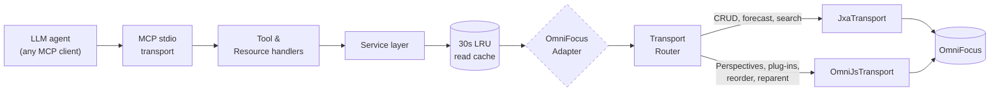

# omnifocus-mcp

[](https://www.npmjs.com/package/@torsday/omnifocus-mcp)
[](https://github.com/torsday/omnifocus-mcp/actions/workflows/ci.yml?query=branch%3Amain)
[](./LICENSE)
[](./package.json)
[](https://www.apple.com/macos/)
[](./docs/adr/0017-mutation-testing-release-gate.md)

> **Give any MCP-compatible AI assistant full, typed access to your OmniFocus.** Read your inbox, create tasks, close projects, batch-update dozens of items, evaluate perspectives, trigger sync — all through natural language. `omnifocus-mcp` wires an 80-tool MCP server directly to OmniFocus on macOS via JXA and OmniJS, with circuit breakers, rate limits, and an agent-aware error hierarchy so the assistant knows exactly what to do next when something goes wrong.

---

## Table of contents

- [Agent-native OmniFocus — beyond the app surface](#agent-native-omnifocus--beyond-the-app-surface)
- [Why this exists](#why-this-exists)
- [Quick start](#quick-start)
- [Security & trust](#security--trust)
- [Architecture at a glance](#architecture-at-a-glance)
- [Status and roadmap](#status-and-roadmap)
- [Reference docs](#reference-docs)
- [Contributing](#contributing)
- [License](#license)

---

## Agent-native OmniFocus — beyond the app surface

A plain MCP wrapper would be a one-to-one mirror of the OmniFocus app. This server is more than that. It exposes a small set of capabilities that exist *because* an LLM is the caller — capabilities the app itself doesn't ship and probably never will, because they're only worth the effort when the consumer is an agent that can reason over structured input and act on the result.

These are the agent-native capabilities, framed in the user outcome they enable:

- **Stalled-project triage** — `omnifocus://project-health` returns granular signals (last activity, available task count, deferred-future tasks, review-overdue) so an agent can identify projects worth a status nudge without the user opening the app. Mechanical aggregation; the app could do it but doesn't.
- **Semantic dedupe** — [`task_find_similar`](docs/tools.md#task_find_similar) does lexical similarity search across task names so an agent confirms intent ("is this a duplicate of X?") before creating a new task. Possible without an LLM, but only useful with one in the loop.
- **Taxonomy audit** — `omnifocus://taxonomy-audit` flags inconsistent tag/folder usage so an agent can propose cleanup grounded in the actual structure of the database. Mechanical.
- **NL perspective authoring** *(in development — [#476](https://github.com/torsday/omnifocus-mcp/issues/476))* — describe a perspective in prose; the agent compiles a rule tree and writes it via `perspective_create`. Exists *because* of the agent — the rule tree is a non-trivial structure most users won't compose by hand.
- **Time-budget reconciliation** — [`forecast_pack`](docs/tools.md#forecast_pack) takes a daily minute budget and packs the forecast into it, surfacing overloaded days. Asking "I have 90 minutes, what should I do?" gets a structured answer.
- **Retrospective resource** — `omnifocus://retrospective?from=…&to=…` aggregates the closed-task surface so an agent can write the user's weekly review against real data instead of asking them to recap.
- **Project templates** — [`project_template_save`](docs/tools.md#project_template_save) / [`_instantiate`](docs/tools.md#project_template_instantiate) capture and replay project structures with parameter substitution and date shifting. The agent fills the parameters from conversation context.
- **Inbox-triage prompt** — the bundled `inbox-triage` MCP prompt sequences the tool calls for a full GTD-style processing sweep. Intentionally a prompt, not a tool — the value is in orchestrating the existing surface.
- **Calendar + agenda** — `omnifocus://calendar` and `omnifocus://agenda` merge macOS Calendar events with the OF forecast so an agent can answer "what does my day actually look like?" without the user holding two windows side by side.

> **How this is different from a plain wrapper.** A wrapper exposes the app's verbs. This server adds verbs the app doesn't have, because LLMs change what's worth building. Some of the additions (project-health, taxonomy-audit) are mechanical aggregations the app *could* ship and never has — they sit unbuilt because no human wants to click through them. Others (NL perspective authoring, semantic dedupe, time-budget reconciliation) are only valuable with an LLM in the call path. Both kinds belong here. The split is honest: don't pretend the mechanical stuff is novel, and don't pretend the agent-only stuff is just sugar.

---

## Why this exists

OmniFocus is a powerful GTD tool, but it's an island. Your tasks sit there while you context-switch between your AI assistant and your task manager, manually copy-pasting notes, updating projects, and trying to keep everything in sync with your actual work.

`omnifocus-mcp` removes that friction. With it connected, your AI assistant can:

- **Capture** — turn a conversation into tasks directly in OmniFocus, with the right project, tags, due dates, and notes, without you touching the app
- **Review** — pull today's overdue items, this week's forecast, or a full project breakdown into context so the assistant can reason about your workload alongside your work
- **Maintain** — batch-defer a pile of overdue tasks, complete a sprint's worth of items, reorganize projects after a meeting debrief
- **Reflect** — ask "what's in my inbox right now?" or "what projects haven't been reviewed in a month?" and get structured, actionable answers

The server is built to a single-user local-first standard: no network surface, no cloud sync, typed errors with agent-readable remediation hints, safe by default.

See [`docs/examples.md`](./docs/examples.md) for concrete prompt-to-tool-call sequences and [`docs/prompts.md`](./docs/prompts.md) for the bundled MCP prompt templates (`daily-review`, `weekly-review`, `capture-meeting`, `project-planning`).

---

## Quick start

**Prerequisites:** macOS 13 (Ventura) or later · OmniFocus 3.x or 4.x (4.x recommended; some tools require 4.x — see [version compatibility](./docs/troubleshooting.md#omnifocus-version-compatibility)) · Node 24+ (not required for Homebrew install)

1. **Install**
   ```bash
   # Homebrew (no Node required)
   brew install torsday/tap/omnifocus-mcp

   # or npm
   npm install -g @torsday/omnifocus-mcp
   ```

2. **Configure your MCP client.** Every client uses the same `command` + `args` + `env` shape — only the file path and serialization (JSON vs TOML) differ. The universal shape:

   ```text
   command: omnifocus-mcp
   args:    (none)
   env:     OMNIFOCUS_LOG_LEVEL=info   # optional; "debug" is verbose
   ```

   Two common cases inline; full per-client guides at [`docs/clients/`](./docs/clients/) (Claude Code, Claude Desktop, Codex, OpenCode, Pi, generic stdio).

   <details>
   <summary><strong>Claude Code</strong> (CLI; no file edit)</summary>

   ```bash
   claude mcp add omnifocus omnifocus-mcp
   ```
   Detailed: [`docs/clients/claude-code.md`](./docs/clients/claude-code.md)
   </details>

   <details>
   <summary><strong>Claude Desktop</strong> — <code>~/Library/Application Support/Claude/claude_desktop_config.json</code> (JSON)</summary>

   ```json
   {
     "mcpServers": {
       "omnifocus": {
         "command": "omnifocus-mcp",
         "args": [],
         "env": { "OMNIFOCUS_LOG_LEVEL": "info" }
       }
     }
   }
   ```
   Detailed: [`docs/clients/claude-desktop.md`](./docs/clients/claude-desktop.md)
   </details>

3. **Grant macOS Automation permission** on first use — the app running the MCP server will prompt to control OmniFocus; click **OK**. If denied by mistake: **System Settings → Privacy & Security → Automation → [app] → OmniFocus** ✓

4. **Verify** — ask your assistant: *"Use the internal_status tool and tell me what it returns."*

Stuck? See [`docs/troubleshooting.md`](./docs/troubleshooting.md).

---

## Security & trust

`omnifocus-mcp` is a **local-only** Node.js process that drives a **local** OmniFocus app via Apple's `osascript` runtime. Installing this package does not introduce cloud connectivity, telemetry, or network egress that wasn't already on your machine.

```
OmniFocus DB (local) ─→ JXA / OmniJS via osascript (local) ─→ MCP server (local stdio)
                                                                    │
                                                                    ↓
                                                       MCP client (local)
                                                                    │
                                                                    ↓
                                                  LLM provider (only if your client uses one)
```

The LLM hop at the bottom is **your client's** choice, not this package's. If you run a local-only client (or a client configured to use a local model), nothing in this stack reaches the network.

### Hard guarantees

Each guarantee is enforced by code, not by promise. Click through to verify.

- **No network I/O at the source level** — a custom lint rule (`no-network-import`) bans `import` of `node:http`, `node:https`, `node-fetch`, `axios`, `undici`, and `cross-fetch`. CI fails on any new import that would enable network calls. See [`src/linting/customRules.ts` Rule 4](./src/linting/customRules.ts).
- **No stdout writes outside the MCP framing path** — `installStdoutGuard()` proxies `process.stdout.write` at server boot and rejects any write that wouldn't corrupt MCP's JSON-RPC stream. The contract is pinned by [`src/server/stdoutGuard.test.ts`](./src/server/stdoutGuard.test.ts).
- **No telemetry / analytics** — production [`dependencies` in `package.json`](./package.json) are six packages: `@modelcontextprotocol/sdk`, `lru-cache`, `pino`, `ulid`, `zod`, `zod-to-json-schema`. No analytics SDK; nothing phones home.
- **No `postinstall` / `preinstall` scripts** — `package.json` ships with one lifecycle script (`prepublishOnly`) and one dev hook (`prepare` for git hooks). Neither runs when a downstream consumer installs the package.
- **Config secrets redacted from logs** — the boot-time `server.started` event runs config through [`redactConfig`](./src/config/env.ts) before logging; path-shaped values are sha256-hashed (12-char prefix) so even local stderr doesn't leak attachment-path layout.
- **Attachment paths are allowlist-bounded** — every attachment operation passes through [`assertAttachmentPath`](./src/attachment/assertAttachmentPath.ts), which resolves symlinks *before* checking against `OMNIFOCUS_ATTACHMENT_PATHS` (default: `$HOME`) to defeat symlink-escape, and hard-blocks `/System`, `/Library`, and their `/private/*` mirrors regardless of the allowlist.

### Opt-in escape hatch

There is exactly one feature that's gated behind an environment variable because enabling it broadens the threat surface:

- **`OMNIFOCUS_ALLOW_RAW_SCRIPT=1`** — exposes `run_jxa_script` and `run_omnijs_script`, which run arbitrary JXA / OmniJS supplied by the agent. Off by default. When enabled, every invocation emits a `raw_script.invoked` audit event at `info` level (regardless of `OMNIFOCUS_LOG_LEVEL`) including the full script body and tool name. See [ADR-0004](./docs/adr/0004-raw-script-escape-hatch.md) for the rationale.

### Verify it yourself

Three recipes that take seconds; you don't have to take this README's word for any of the above.

1. **Audit the source.** The repo at [github.com/torsday/omnifocus-mcp](https://github.com/torsday/omnifocus-mcp) is the canonical source. Each published artifact is built from its own tagged commit (`v<version>`); compare `dist/index.js` against the build output of the tag matching the version you installed.
2. **Verify the published artifact's provenance.** npm publishes attestations via [Sigstore](https://www.sigstore.dev/):
   ```bash
   npm view @torsday/omnifocus-mcp dist.attestations
   ```
   The `provenance` URL points to the GitHub Actions run that built the artifact, signed with the workflow's OIDC identity.
3. **Inspect what's actually in the tarball.** It should be five files — no more, no less, and no install scripts:
   ```bash
   curl -sL "$(npm view @torsday/omnifocus-mcp dist.tarball)" | tar -tzvf -
   ```
   Expected output (file count = 5):
   ```
   package/LICENSE
   package/dist/index.js
   package/package.json
   package/CHANGELOG.md
   package/README.md
   ```

### Out of scope

The threat model deliberately excludes anything outside this codebase: vulnerabilities in OmniFocus itself, Apple's JXA / OmniJS / `osascript` runtimes, transitive npm-dependency CVEs (track and patch via `npm audit` / Dependabot, but not part of this project's guarantees), and any attacker with root-equivalent local access (who could replace `osascript`, the MCP server binary, or your shell). See [SECURITY.md § Scope](./SECURITY.md#scope).

Full threat model: [`SECURITY.md`](./SECURITY.md), [`docs/design/security.md`](./docs/design/security.md).

---

## Architecture at a glance



**Key design points:**

- **Adapter seam** — services never see `osascript` or URL schemes; `OmniFocusAdapter` is the only OS boundary. Tests swap in an `InMemoryAdapter`.
- **Dual transport** — JXA via `osascript` for CRUD; OmniJS via `evaluateJavascript()` for custom perspectives, plug-ins, reorder, and reparent. A `TransportRouter` picks per operation.
- **Read pool + write queue** — concurrent JXA reads from a configurable pool; mutations serialized through a write queue; OmniJS operations through a separate queue.
- **30s LRU read cache** — invalidated on every write. Mutations are never served stale.
- **Middleware stack** — every registered tool runs through: `assertNotShuttingDown` → `circuitBreaker` → `rateLimitMeta` → `loopDetection`.

The full layered diagram with queues, circuit breakers, and the test adapter lives in [`docs/design/architecture.md`](./docs/design/architecture.md).

---

## Status and roadmap

The package is [published on npm](https://www.npmjs.com/package/@torsday/omnifocus-mcp); see the [latest release](https://github.com/torsday/omnifocus-mcp/releases/latest) for the current version and notes. The phase table below records the milestone work that shipped in v1.0.0; the live backlog and future enhancements track on the [Project board](https://github.com/users/torsday/projects/4), and the [unreleased section of the CHANGELOG](./CHANGELOG.md#unreleased) lists what's already merged toward the next release.

| Phase | Milestone | Status |
|---|---|---|
| M0 | Foundation + both transports | ✅ Done |
| M1 | Core task & project surface | ✅ Done |
| M2 | Metadata + perspectives (OmniJS) | ✅ Done |
| M3 | Advanced (repeat, notes, review, batch, DSL) | ✅ Done |
| M4 | Long tail (attachments, OPML, sync, plug-ins, raw scripts) | ✅ Done |
| M5 | Polish & release (observability, E2E, CI, docs, npm) | ✅ Done |

Track open issues and future enhancements on the [**GitHub Project board**](https://github.com/users/torsday/projects/4).

---

## Reference docs

| Doc | What |
|---|---|
| [`docs/tools.md`](./docs/tools.md) | Auto-generated reference for every tool — input schemas, examples, responses |
| [`src/tools/INDEX.md`](./src/tools/INDEX.md) | One-line-per-tool index grouped by domain (cheaper than grepping) |
| [`docs/examples.md`](./docs/examples.md) | Concrete prompt → tool-call sequences |
| [`docs/prompts.md`](./docs/prompts.md) | Bundled MCP prompt templates (`daily-review`, `weekly-review`, `capture-meeting`, `project-planning`) |
| [`AGENTS.md`](./AGENTS.md) | Agent-facing guide — engineering conventions for contributors AND calling conventions for clients (IDs, error codes, dates, idempotency, `_links`, response envelope, `meta.warnings`, rate limits) |
| [`docs/clients/`](./docs/clients/) | Per-client setup guides (Claude Code, Claude Desktop, Codex, OpenCode, Pi, generic stdio) |
| [`docs/troubleshooting.md`](./docs/troubleshooting.md) | OmniFocus not running, Automation permission, slow startup, raw-script gating, sync staleness |
| [`docs/domain-reference.md`](./docs/domain-reference.md) | OmniFocus glossary, canonical schemas, lossiness matrix for export/import |
| [`docs/security.md`](./docs/security.md) | Attack surface, mitigations, test coverage |
| [`SECURITY.md`](./SECURITY.md) | Vulnerability reporting, scope |
| [`SPEC.md`](./SPEC.md) | Functional scope and resolved v1 decisions |
| [`DESIGN.md`](./DESIGN.md) | Index of the per-area design files under [`docs/design/`](./docs/design/) — architecture, envelope, IDs/dates, security, testing, observability, configuration, distribution, example tool, resources |
| [`docs/adr/`](./docs/adr/) | Architecture Decision Records — every load-bearing choice (TypeScript+Node 24, dual transport, namespacing, raw-script gating, scripts-as-files, LRU cache, ISO-8601 dates, branded IDs, pool+queue, stdio transport, semver, npx distribution, response envelope, E2E adapter switch, NL envelope, webhooks, Stryker mutation gate, EventKit calendar bridge, cross-transport ID interop, JXA helper inlining, reactive runtime spike, envelope text/structured split, runner-host JXA bridge contention) |
| [`CHANGELOG.md`](./CHANGELOG.md) | Release history per [Keep a Changelog](https://keepachangelog.com/) |

For the **full environment-variable surface** with override semantics see [`docs/design/configuration.md`](./docs/design/configuration.md); the load-bearing knobs are `OMNIFOCUS_LOG_LEVEL`, `OMNIFOCUS_CACHE_TTL_MS`, `OMNIFOCUS_ALLOW_RAW_SCRIPT`, and `OMNIFOCUS_ATTACHMENT_PATHS`.

---

## Contributing

This is a single-developer project; external contributions are not currently solicited. The design, ADRs, and task backlog are public so the work is inspectable and forkable. See [`CONTRIBUTING.md`](./CONTRIBUTING.md) for the patterns any contribution would need to follow.

---

## License

MIT — see [`LICENSE`](./LICENSE).
