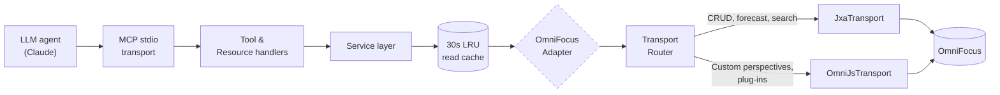

# omnifocus-mcp

[](./SPEC.md)
[](./TASKS.md)
[](./LICENSE)
[](./package.json)
[](https://www.apple.com/macos/)
[](https://www.conventionalcommits.org)

> **An MCP server exposing the full OmniFocus surface to LLM agents.** Ask Claude or any MCP-compatible client to read, query, create, and modify your OmniFocus tasks, projects, tags, perspectives, and attachments — through 60+ typed tools, built to a "single-user local-first" standard with engineering excellence as a first-class goal.

---

## Table of contents

- [What it is](#what-it-is)
- [Architecture at a glance](#architecture-at-a-glance)
- [Status and roadmap](#status-and-roadmap)
- [Install (once built)](#install-once-built)
- [Design documents](#design-documents)
- [Project conventions](#project-conventions)
- [Contributing](#contributing)
- [License](#license)

---

## What it is

`omnifocus-mcp` is an MCP (Model Context Protocol) server that gives any MCP-compatible client — Claude Desktop, Claude Code, or any stdio-speaking agent — full, typed, audited access to OmniFocus on macOS.

- **Full coverage.** Tasks, projects, tags, folders, perspectives (built-in and custom), forecast, review, notes, attachments, batch operations, import/export, sync.
- **Two transports, one interface.** JXA via `osascript` for 85% of OmniFocus; OmniJS via the URL scheme for custom perspectives, plug-ins, and newer features. A `TransportRouter` picks per operation; services never see the transport.
- **Typed everything.** Zod at the API boundary, branded opaque IDs, ISO-8601 with offset dates, discriminated error hierarchy.
- **Agent-aware.** Every tool description follows the [`agent_systems.md`](https://github.com/torsday/llm_prompts/blob/main/agent_systems.md) "what / when not / returns / side effects" standard. Errors carry `{ code, message, suggestion, details }` so agents know what to do next.
- **Safe by default.** No network surface, no stdout writes (MCP uses stdio), opt-in escape hatches, circuit breakers, rate limits, write serialization.

## Architecture at a glance



The full layered diagram with the in-memory test adapter, queues, and circuit breakers lives in [`DESIGN.md §6`](./DESIGN.md#6-architecture).

## Status and roadmap

Design is **complete** (SPEC + DESIGN + 13 ADRs + domain reference). Implementation proceeds across six milestones:

| Phase | Milestone                                           | Ships                                                                   |
| ----- | --------------------------------------------------- | ----------------------------------------------------------------------- |
| M0    | **Foundation + both transports**                    | adapter seam, JXA + OmniJS, pool/queue, cache, errors, lifecycle        |
| M1    | **Core task & project surface + pagination**        | 25+ tools covering daily CRUD                                           |
| M2    | **Metadata + perspectives (OmniJS-enabled)**        | tags, folders, forecast, search, built-in and custom perspectives       |
| M3    | **Advanced**                                        | repetition rules, rich-text notes, review, batch, transport text        |
| M4    | **Long tail**                                       | attachments, taskpaper/opml, sync, plug-in invocation, opt-in raw scripts |
| M5    | **Polish & release**                                | loop detection, `internal_status`, E2E tests, CI, docs, `npx` distribution |

Track live progress on the [**GitHub Project board**](https://github.com/users/torsday/projects/4). **25 issues are `Status = Ready` right now** — see [`docs/dependency-graph.md`](./docs/dependency-graph.md) for the full dependency graph, critical path, and recommended work order. See [`TASKS.md`](./TASKS.md) for the sequenced backlog narrative.

## Install (once built)

```bash
# Claude Desktop — add to ~/Library/Application Support/Claude/claude_desktop_config.json
{
  "mcpServers": {
    "omnifocus": {
      "command": "npx",
      "args": ["-y", "@torsday/omnifocus-mcp"],
      "env": { "OMNIFOCUS_LOG_LEVEL": "info" }
    }
  }
}

# Claude Code
claude mcp add omnifocus -- npx -y @torsday/omnifocus-mcp

# Or run standalone
npm install -g @torsday/omnifocus-mcp
omnifocus-mcp
```

On first run, macOS asks permission for Claude to automate OmniFocus. Grant it via **System Settings → Privacy & Security → Automation**. See [`docs/troubleshooting.md`](./docs/) (M5) for the recovery path if you deny.

### Environment variables

| Variable                        | What                                                | Default |
| ------------------------------- | --------------------------------------------------- | ------- |
| `OMNIFOCUS_LOG_LEVEL`           | `trace`\|`debug`\|`info`\|`warn`\|`error`            | `info`  |
| `OMNIFOCUS_CACHE_TTL_MS`        | Read-cache TTL                                      | `30000` |
| `OMNIFOCUS_READ_POOL_SIZE`      | Concurrent `osascript` processes for reads          | `2`     |
| `OMNIFOCUS_WRITE_QUEUE_CAP`     | Max pending writes before `QueueFull`               | `50`    |
| `OMNIFOCUS_JXA_TIMEOUT_MS`      | Per-call JXA timeout                                | `30000` |
| `OMNIFOCUS_OMNIJS_TIMEOUT_MS`   | Per-call OmniJS timeout                             | `45000` |
| `OMNIFOCUS_ATTACHMENT_PATHS`    | `$HOME`-rooted allowlist, colon-separated           | `$HOME` |
| `OMNIFOCUS_MAX_ATTACHMENT_MB`   | Max attachment size                                 | `100`   |
| `OMNIFOCUS_TOOL_RATE_LIMIT`     | Per-tool rate limit `N/SECONDS`                     | `120/60`|
| `OMNIFOCUS_ALLOW_RAW_SCRIPT`    | Register `run_jxa_script` / `run_omnijs_script`     | `unset` |
| `OMNIFOCUS_INTEGRATION`         | Enable integration test suite                       | `unset` |

Full table with descriptions and override semantics: [`DESIGN.md §22`](./DESIGN.md#22-configuration--environment).

## Design documents

- **[`SPEC.md`](./SPEC.md)** — functional scope and non-functional requirements; resolved v1 decisions
- **[`DESIGN.md`](./DESIGN.md)** — 28-section architecture; options evaluated; R/S/M assessment; example tool implementation
- **[`TASKS.md`](./TASKS.md)** — sequenced backlog across M0–M5 milestones
- **[`docs/domain-reference.md`](./docs/domain-reference.md)** — OmniFocus glossary, canonical schemas, lossiness matrix for export/import
- **[`docs/adr/`](./docs/adr/)** — 13 Architecture Decision Records covering every load-bearing choice:

| # | Decision |
|---|---|
| [0001](./docs/adr/0001-language-and-runtime.md) | TypeScript on Node.js 20 LTS |
| [0002](./docs/adr/0002-omnifocus-transport-dual.md) | JXA + OmniJS dual transport |
| [0003](./docs/adr/0003-tool-surface-namespaced.md) | `<noun>_<verb>` tool namespacing |
| [0004](./docs/adr/0004-raw-script-escape-hatch.md) | Opt-in raw-script tools |
| [0005](./docs/adr/0005-script-assets-as-files.md) | Scripts as first-class files |
| [0006](./docs/adr/0006-read-cache-strategy.md) | 30s LRU, invalidate-on-write |
| [0007](./docs/adr/0007-dates-iso8601-with-offset.md) | ISO-8601 with offset at the boundary |
| [0008](./docs/adr/0008-ids-branded-opaque-strings.md) | Branded opaque ID types |
| [0009](./docs/adr/0009-concurrency-pool-and-queue.md) | Read pool + write queue + OmniJS queue |
| [0010](./docs/adr/0010-mcp-transport-stdio.md) | stdio-only MCP transport (v1) |
| [0011](./docs/adr/0011-versioning-and-stability.md) | Semver with explicit contract |
| [0012](./docs/adr/0012-distribution-npx.md) | Distribution via `npx` / npm |
| [0013](./docs/adr/0013-tool-response-envelope.md) | Uniform response envelope |

## Project conventions

Project conventions (adapter seam, script-asset discipline, ID-only lookups, date contract, cache invalidation, attachments-by-path) live in [`CLAUDE.md`](./CLAUDE.md). Any contribution follows the standards from [`coding.md`](https://github.com/torsday/llm_prompts/blob/main/coding.md), [`systems_design.md`](https://github.com/torsday/llm_prompts/blob/main/systems_design.md), and [`agent_systems.md`](https://github.com/torsday/llm_prompts/blob/main/agent_systems.md).

## Contributing

This is a single-developer project; external contributions are not currently solicited. The design, ADRs, and task backlog are nevertheless public so the work is inspectable and forkable. See [`CONTRIBUTING.md`](./CONTRIBUTING.md) for the patterns any contribution would need to follow.

## License

[MIT](./LICENSE) — see full text in `LICENSE`.
