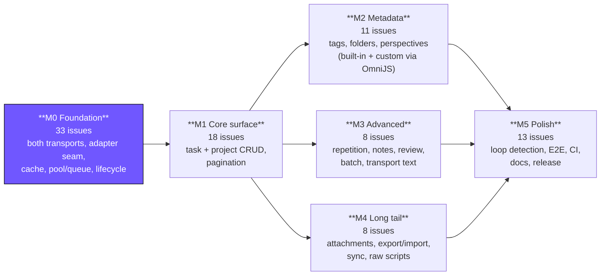
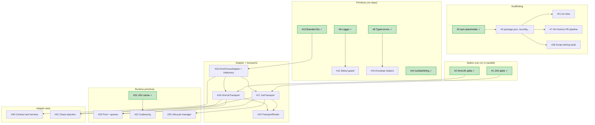
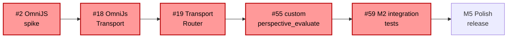
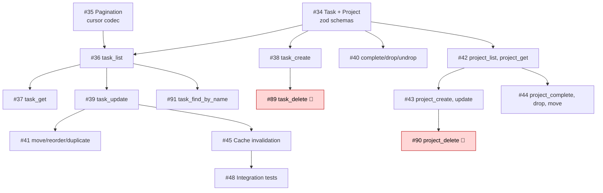

# Dependency graph & work order

**How to start on this project.** The 91 issues form a directed acyclic graph. This doc makes the structure visible so you know which issues are ready now, which unlock next, and where the critical path runs.

**Live state:** 25 issues are `Status = Ready` on the [project board](https://github.com/users/torsday/projects/4). The rest wait on one or more blockers. As blockers close, move their dependents from `Todo` to `Ready`.

---

## 1. Start-here set — 25 issues ready right now

These have zero blockers — pick any up.

### Pure research

- [#1](https://github.com/torsday/omnifocus-mcp/issues/1) Validate JXA round-trip — spike, 0.5 day
- [#2](https://github.com/torsday/omnifocus-mcp/issues/2) Validate OmniJS URL scheme + callback — spike, 1 day

### Scaffolding

- [#3](https://github.com/torsday/omnifocus-mcp/issues/3) npm placeholder
- [#6](https://github.com/torsday/omnifocus-mcp/issues/6) `.claude/settings.json`

### Infrastructure primitives (mostly independent)

- [#8](https://github.com/torsday/omnifocus-mcp/issues/8) Typed error hierarchy
- [#9](https://github.com/torsday/omnifocus-mcp/issues/9) Structured logger
- [#10](https://github.com/torsday/omnifocus-mcp/issues/10) Correlation-ID generator
- [#12](https://github.com/torsday/omnifocus-mcp/issues/12) Env-var config loader
- [#13](https://github.com/torsday/omnifocus-mcp/issues/13) Branded ID types
- [#14](https://github.com/torsday/omnifocus-mcp/issues/14) `isoDateString()` zod helper
- [#21](https://github.com/torsday/omnifocus-mcp/issues/21) LRU read cache
- [#23](https://github.com/torsday/omnifocus-mcp/issues/23) Per-tool circuit breaker
- [#24](https://github.com/torsday/omnifocus-mcp/issues/24) Per-tool rate limiter
- [#26](https://github.com/torsday/omnifocus-mcp/issues/26) Graceful shutdown
- [#27](https://github.com/torsday/omnifocus-mcp/issues/27) MCP server bootstrap

### Tests + fixtures (infra)

- [#32](https://github.com/torsday/omnifocus-mcp/issues/32) Integration seed-fixture script

### Docs that can start anytime

- [#33](https://github.com/torsday/omnifocus-mcp/issues/33) Initial README
- [#69](https://github.com/torsday/omnifocus-mcp/issues/69) Attachment path-scope validator (standalone)
- [#70](https://github.com/torsday/omnifocus-mcp/issues/70) Attachment size cap (standalone)
- [#78](https://github.com/torsday/omnifocus-mcp/issues/78) Tool-description lint test
- [#80](https://github.com/torsday/omnifocus-mcp/issues/80) E2E harness
- [#84](https://github.com/torsday/omnifocus-mcp/issues/84) Full README
- [#86](https://github.com/torsday/omnifocus-mcp/issues/86) Client config snippets
- [#87](https://github.com/torsday/omnifocus-mcp/issues/87) CHANGELOG + release notes
- [#88](https://github.com/torsday/omnifocus-mcp/issues/88) Permission-prompt runbook

---

## 2. Phase-level flow

How the milestones relate. M0 enables everything; M1 core unlocks M2/M3/M4; M5 wraps up.



---

## 3. M0 internal dependency graph (the foundation)

Key structure: two spikes → adapter interface → transports → everything else. Nodes marked ✓ are in the start-here set (no blockers).



**Read-out:** both spikes (#1, #2) are the top of the graph. They unlock the transports (#17, #18), which unlock the router (#19). The router unlocks most of M2. The infrastructure primitives (#8, #9, #13, #14, #21) are independent and can be built in any order.

---

## 4. Critical path

Longest unbroken dependency chain from start to ship. Gates the schedule floor.



**Why this path.** Custom-perspective evaluation is load-bearing (user's primary workflow) and requires the complete OmniJS stack. Any delay in the OmniJS spike (#2), OmniJsTransport (#18), or TransportRouter (#19) pushes M2 out.

**Parallel track:** The JXA path (#1 → #17) can run fully in parallel and unlocks M1 independently. Ship v0.1 from M1-on-JXA without waiting for OmniJS.

---

## 5. M1 internal flow

Mostly linear.



---

## 6. Recommended work order

One sensible path through the work for a solo developer. Not prescriptive — just a defensible default.

### Day 1–2 (M0 start)

Two tracks in parallel:

- **Research track:** #1 JXA spike → #2 OmniJS spike (1 person, 1.5 days total)
- **Scaffolding track:** #3 → #4 → #5 → #6 → #7 (npm + project skeleton + CI; 1 day total)

Both tracks produce independent outputs; merge back at day 2.

### Day 3–5 (M0 primitives)

Fan out into small parallel work:

- Primitives (independent, any order): #8 errors → #9 logger → #13 IDs → #14 dates → #15 envelope → #21 cache → #23 circuit breaker → #24 rate limiter → #11 stdout guard → #10 correlation IDs → #12 config
- Adapter interface + InMemoryAdapter: #16 (needs #13)
- MCP bootstrap: #27 (needs nothing; do it while other things are pending)

### Day 6–10 (M0 transports + runtime)

Critical path work — single-threaded by necessity.

- #17 JxaTransport (needs #1, #16)
- #18 OmniJsTransport (needs #2, #16)
- #19 TransportRouter (needs #17, #18)
- #20 Pool + queues (needs #17, #18)
- #25 Lifecycle manager (needs #17)
- #30 Contract test harness (needs #16) — run against every implementation as they land
- #31 Chaos harness (needs #17, #18)

### Day 11+ (M0 → M1 handoff)

Everything else in M0 becomes trivial. M1 opens up with #34 (domain schemas) and #35 (cursor codec).

### Throughout: docs + tests in the gaps

- #29 app_launch (5-minute task; between other things)
- #33 Initial README (5-minute task)
- #32 Seed fixtures (1 day; schedule before first integration test run)

### Thinking about M4 attachments and M5 docs

Both have independent issues you can start early:

- #69, #70 — attachment validators are pure logic; can write anytime
- #78, #80 — test infrastructure can go ahead of production code
- #84, #86, #87, #88 — docs can iterate in parallel with code

---

## 7. How this keeps working

Three habits keep the board useful:

1. **When you close an issue, check its "blocks:" list** (or just scan `gh issue list` for `Blocked by: #<closed-num>`) and flip those downstream issues from `Todo` to `Ready`. One line of `gh project item-edit` per issue.

2. **When you pick up a ready issue**, flip it to `In Progress`. One click on the project board.

3. **When you hit an unanticipated dependency**, add it to both issues' bodies (`Blocked by: #N`, `Blocks: #M`). Keeps the graph honest.

The project's [`🗂️ Kanban`](https://github.com/users/torsday/projects/4) view becomes a live picture of the project's state: Ready column shows what's up next, In Progress shows active work, Blocked surfaces problems.

---

## 8. Regenerating this graph

This doc was generated by parsing `- Blocked by: #N` references out of issue bodies. To refresh after new issues land:

```bash
gh issue list --state open --limit 200 --json number,title,body \
  | jq -r '.[] | [.number, (.body | capture("Blocked by: (?<deps>[^\\n]*)"; "m")?.deps // "")] | @tsv'
```

The `scripts/set-ready-status.sh` script can be re-run (with an updated `READY_NUMBERS` array) to resync the board's Status field with the current blocker graph.
