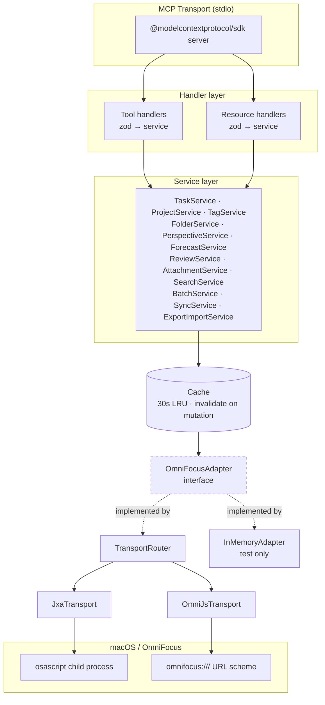

<!-- Originally DESIGN.md §6 (split per #805) -->

# Architecture

## Layering



The **adapter interface is the critical seam.** Services never touch `osascript` or URL schemes. Tests swap `InMemoryAdapter` for zero-friction unit coverage; real use swaps in `TransportRouter`, which picks JXA or OmniJS per operation.

## Directory layout

```
omnifocus-mcp/
├── AGENTS.md
├── SPEC.md
├── DESIGN.md
├── README.md
├── package.json
├── tsconfig.json
├── biome.json
├── vitest.config.ts
├── docs/
│   └── adr/
│       ├── 0001-language-and-runtime.md
│       ├── 0002-omnifocus-transport-dual.md
│       ├── 0003-tool-surface-namespaced.md
│       ├── 0004-raw-script-escape-hatch.md
│       ├── 0005-script-assets-as-files.md
│       └── 0006-read-cache-strategy.md
├── src/
│   ├── index.ts                 # entry point
│   ├── server/
│   │   ├── mcpServer.ts
│   │   ├── registerTools.ts
│   │   └── registerResources.ts
│   ├── tools/
│   │   ├── task/
│   │   │   ├── list.ts
│   │   │   ├── get.ts
│   │   │   ├── create.ts
│   │   │   └── …
│   │   ├── project/
│   │   └── …
│   ├── resources/
│   │   ├── inbox.ts
│   │   ├── forecastToday.ts
│   │   └── …
│   ├── services/
│   │   ├── taskService.ts
│   │   ├── projectService.ts
│   │   └── …
│   ├── domain/
│   │   ├── task.ts              # types + zod schemas
│   │   ├── project.ts
│   │   ├── tag.ts
│   │   ├── folder.ts
│   │   ├── perspective.ts
│   │   ├── repetition.ts
│   │   ├── attachment.ts
│   │   ├── review.ts
│   │   └── ids.ts               # branded ID types
│   ├── adapter/
│   │   ├── OmniFocusAdapter.ts  # interface
│   │   ├── router.ts            # TransportRouter
│   │   ├── jxa/
│   │   │   └── JxaTransport.ts
│   │   ├── omnijs/
│   │   │   └── OmniJsTransport.ts
│   │   └── inMemory/
│   │       └── InMemoryAdapter.ts
│   ├── scripts/
│   │   ├── jxa/
│   │   │   ├── task_list.js
│   │   │   ├── task_create.js
│   │   │   └── …
│   │   └── omnijs/
│   │       ├── perspective_evaluate.js
│   │       └── plugin_invoke.js
│   ├── cache/
│   │   └── lruCache.ts
│   ├── errors/
│   │   └── index.ts
│   ├── logging/
│   │   └── logger.ts
│   └── config/
│       └── env.ts
└── tests/
    ├── unit/
    └── integration/             # gated by OMNIFOCUS_INTEGRATION=1
```

A new developer reading the directory tree should be able to answer "where does X live?" without opening any files. This is the evaluation checklist test: `Can a new developer understand this system's structure from its directory layout alone?` — yes.

## Adapter interface

```typescript
export interface OmniFocusAdapter {
  // Tasks
  listTasks(filter: TaskFilter): Promise<Task[]>
  getTask(id: TaskId): Promise<Task>
  createTask(input: CreateTaskInput): Promise<TaskId>
  updateTask(id: TaskId, patch: UpdateTaskInput): Promise<void>
  completeTask(id: TaskId, at?: Date): Promise<void>
  // …one method per SPEC functional requirement

  // Metadata
  syncTrigger(): Promise<SyncStatus>
  getLastSync(): Promise<SyncStatus>

  // Raw (only wired when opt-in)
  runJxaScript?(script: string): Promise<unknown>
  runOmniJsScript?(script: string): Promise<unknown>
}
```

All three transports (`JxaTransport`, `OmniJsTransport`, `InMemoryAdapter`) implement the same contract. `TransportRouter` is itself an `OmniFocusAdapter` that delegates per-method to the right underlying transport.

## Script asset discipline — ADR-0005

JXA/OmniJS scripts live as `.js` files under `src/scripts/`. Each script:

- Reads a single JSON argument from `process.argv[1]` (JXA) or `argument` (OmniJS)
- Returns a single JSON string via `JSON.stringify` as the last expression
- Is typed via JSDoc, linted, and bundled as a string at build time (`tsup` loader)

This scales cleanly to 50+ scripts where inline template literals would not.

## Caching — ADR-0006

- LRU cache, default TTL 30s, default capacity 256 entries, keyed by tool name + serialized args
- Read tools consult cache first, fall through to adapter on miss
- Every mutating service method emits a cache-invalidation event covering a typed scope:
  - `task_update(id)` → invalidates `task:${id}`, `project:${projectId}`, `forecast:*`, `perspective:*`, `search:*`
  - Conservative invalidation is correct; speculative fine-grained invalidation is out of scope
- Cache is in-memory only; no persistence. Server restart = cold cache.

## Concurrency

- **Reads:** parallel within the adapter; JXA transport internally queues to serialize against `osascript` (one child process at a time is safer than many concurrent)
- **Writes:** strictly serialized via a single-slot queue. A write in flight blocks subsequent writes until complete. Reads may proceed concurrently (dirty-read of cache tolerated).
- **OmniJS writes:** same queue, with an additional timeout because URL-scheme callbacks are async and can genuinely hang if OF is wedged

## Error taxonomy

Authoritative list. Every throw in the server is one of these; generic `Error` is forbidden by lint rule. Grouped by remediation class so an agent reading an error knows, at a glance, whether to retry, wait, fix input, or stop and ask the user.

```typescript
class OmniFocusError extends Error { readonly code: string }

// Environment — retry is pointless; user action required
class OmniFocusNotRunning       extends OmniFocusError { code = "OF_NOT_RUNNING" }
class PermissionDenied          extends OmniFocusError { code = "OF_PERMISSION_DENIED" }
class FeatureRequiresPro        extends OmniFocusError { code = "OF_FEATURE_REQUIRES_PRO" }
class FeatureRequiresOfVersion  extends OmniFocusError { code = "OF_FEATURE_REQUIRES_VERSION" }

// Input — agent should fix the input before retrying
class ValidationError           extends OmniFocusError { code = "OF_VALIDATION" }
class NotFound                  extends OmniFocusError { code = "OF_NOT_FOUND" }

// Transient — agent may retry after waiting
class Timeout                   extends OmniFocusError { code = "OF_TIMEOUT" }
class RateLimited               extends OmniFocusError { code = "OF_RATE_LIMITED" }    // wall-clock wait
class QueueFull                 extends OmniFocusError { code = "OF_QUEUE_FULL" }      // write queue saturated
class CircuitOpen               extends OmniFocusError { code = "OF_CIRCUIT_OPEN" }

// Infrastructure — usually transient but not the agent's to fix
class TransportUnavailable      extends OmniFocusError { code = "OF_TRANSPORT_UNAVAILABLE" }
class ScriptError               extends OmniFocusError { code = "OF_SCRIPT_ERROR" }

// Server lifecycle — stop and reconnect
class ServerShuttingDown        extends OmniFocusError { code = "OF_SHUTTING_DOWN" }
```

`RateLimited`, `QueueFull`, and `CircuitOpen` are distinct top-level classes — **not** subclasses of `ValidationError`. An agent interprets "validation" as "your input is bad; tell the user." Backpressure is "the system is busy; wait." Conflating them causes agents to surface the wrong remediation.

Tool handlers catch these at the boundary and translate to MCP error responses with structured `{ code, message, suggestion, details }` payloads — per `agent_systems.md` "actionable errors" principle. The `suggestion` field is prescribed per class (default text; each throw site can override).

## Tool description standard

Every tool description follows a four-section template so agents can parse it reliably:

```
<one-sentence summary of what the tool does>

Use when: <the specific scenario that calls for this tool>
Do NOT use when: <sibling tools to prefer instead, and why>

Returns: <shape of the data field — key fields named>
Errors: <which ErrorCodes can occur and what they mean here>

Side effects: <mutates? invalidates cache? triggers sync? idempotent? safe to retry?>
```

Example for `task_find_by_name`:

```
Searches for tasks whose name contains the given string. Returns all matches — never picks one silently.

Use when: you have a task name (e.g. from user input) and need its persistent ID.
Do NOT use when: you already have an ID — use task_get instead (cheaper, unambiguous).

Returns: Task[] — each with id, projectId, projectName, status, dueDate, tags. Empty array if no match.
Errors: OF_NOT_RUNNING, OF_TIMEOUT

Side effects: Read-only. Safe to retry. Cached for 30s.
```

The linter test (TASKS #78) asserts every tool description includes all four sections. The Success Criteria (SPEC) includes an LLM-readability review: a fresh Claude instance must pick the correct tool for 20 representative prompts without additional context.

### Tool-count policy (#478)

Living docs describe the **shape** of the tool surface (domains, verbs, patterns), never the **count**. The capabilities resource (`omnifocus://capabilities`) and `internal_status` publish the live count at runtime; `docs/tools.md` is auto-generated from `ALL_TOOL_DESCRIPTIONS` on every build. Anything else is a copy that decays.

This policy is enforced by `scripts/verify-no-tool-counts.sh`, wired into `meta-lint.yml`. The lint allowlist covers genuinely-dated artifacts:

- `CHANGELOG.md` — historical release entries are point-in-time
- `docs/tools.md` — auto-generated; the count IS the live truth, regenerated per build
- `docs/validation/**` — dated audit / readability reports
- `docs/llm-readability-review-v1.md` — versioned snapshot

Add to the allowlist only with a one-line rationale per entry; rewording is almost always cheaper.

## Observability

- Structured logs via `pino` to stderr
- Every tool call emits one span: `{ tool, durationMs, transport, cacheHit, result, correlationId }`
- No PII (task content) at `info`; only at `debug` or below
- Health surface: `internal_status` tool returns `{ uptimeMs, of_running, last_sync, cache_stats, circuit_states }`

## Circuit breaker

Per `agent_systems.md`. Per-tool, 3 consecutive failures within 60s opens the circuit; subsequent calls fail fast with `CircuitOpen` for 60s before a half-open test. Prevents a broken OF install (e.g. not running, permission revoked) from burning through the agent's context with retries.

## Loop detection

Per `agent_systems.md`. Server tracks recent tool invocations by (tool, serialized-args) hash; if the same invocation occurs ≥5 times within 60s, the next response includes a warning in the structured response: `{ warning: "identical_call_repeated", count, suggestion }`.
